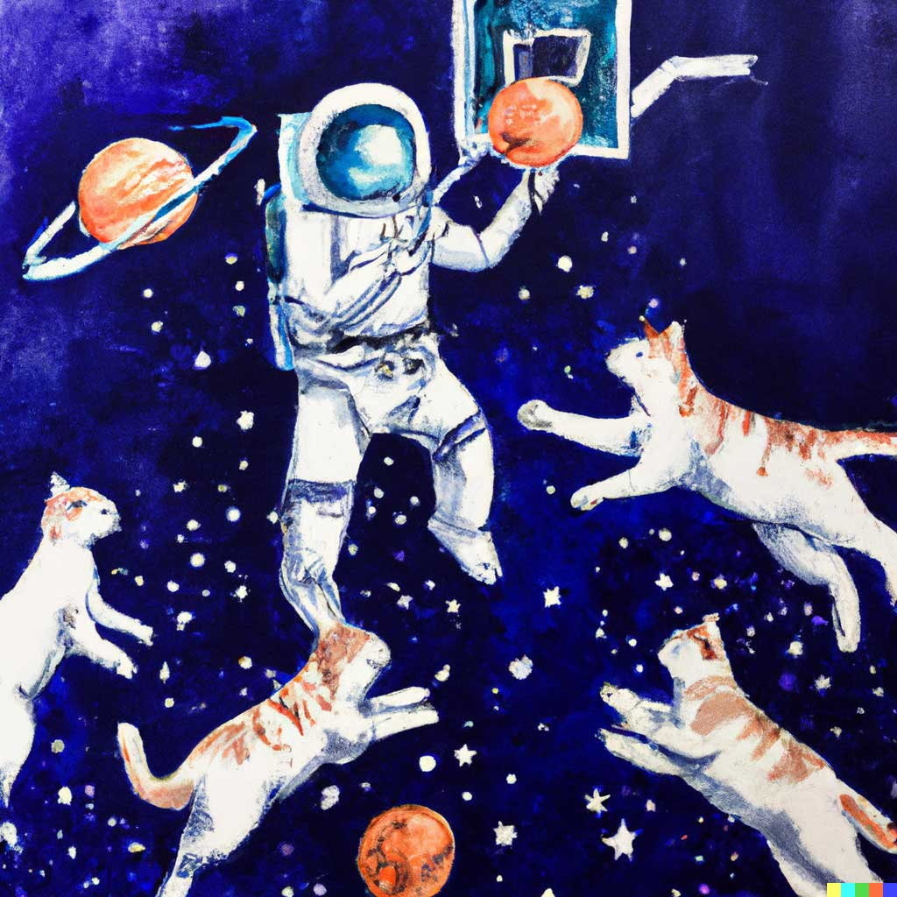
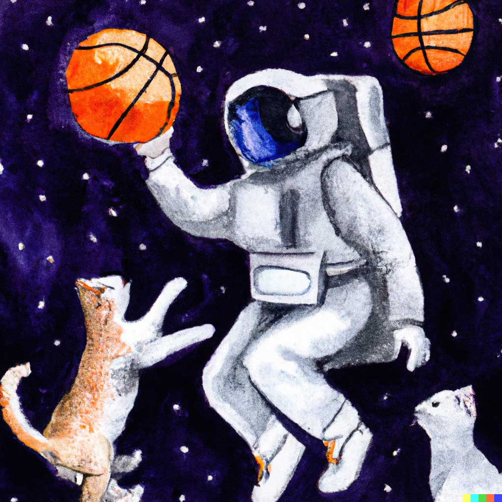
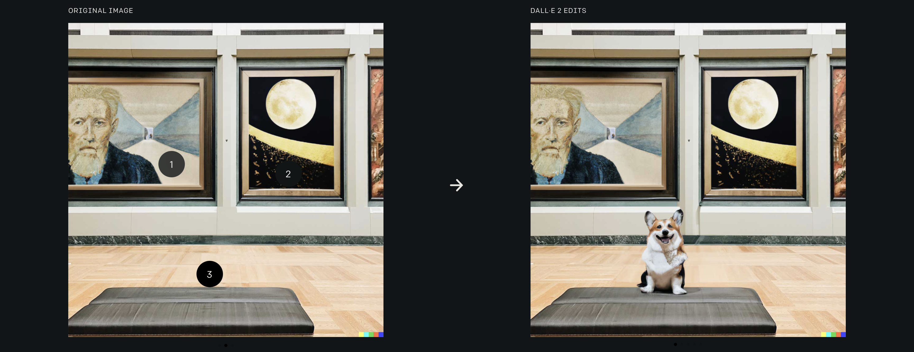
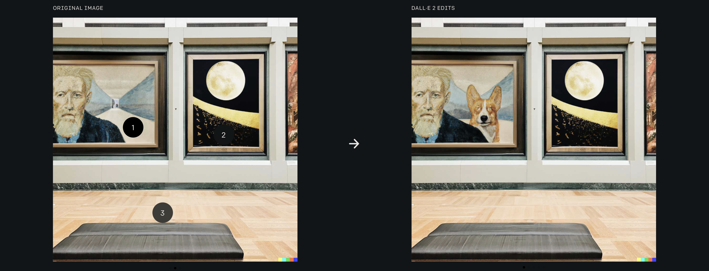
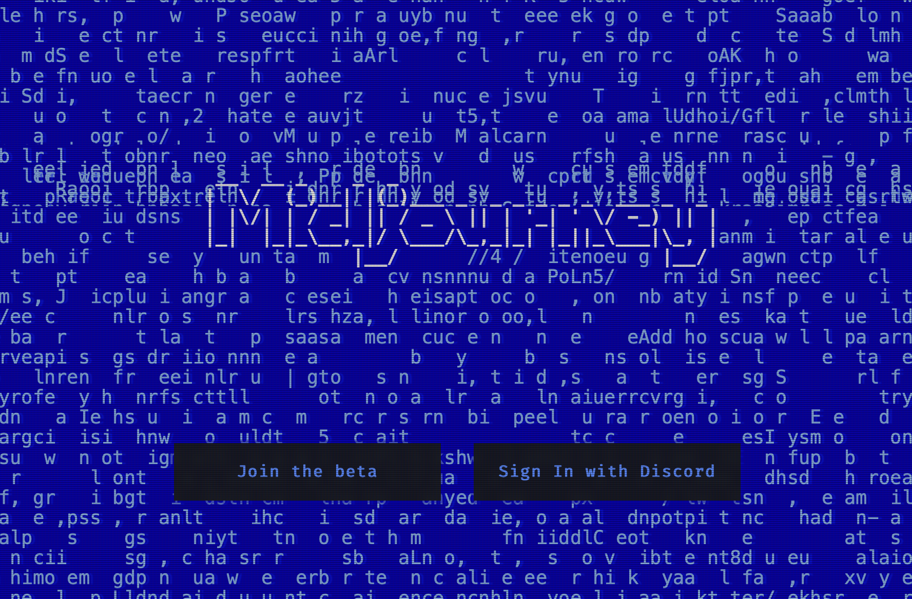
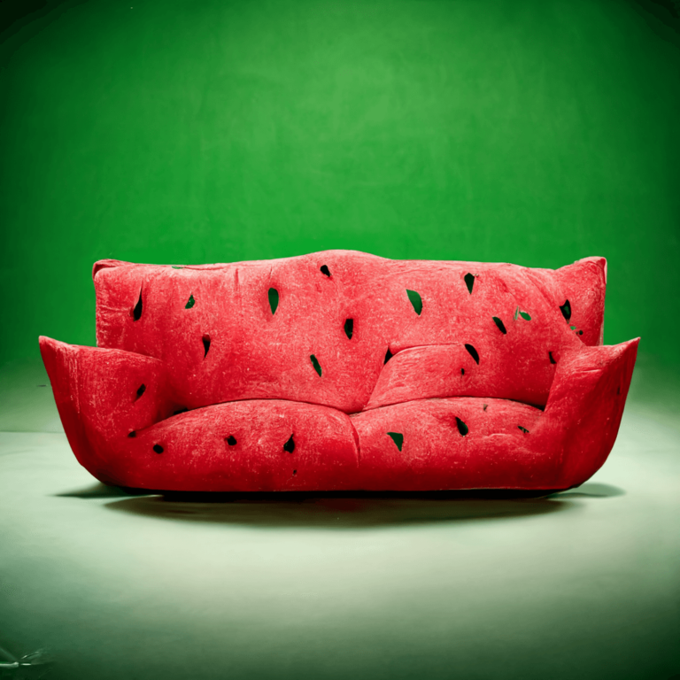
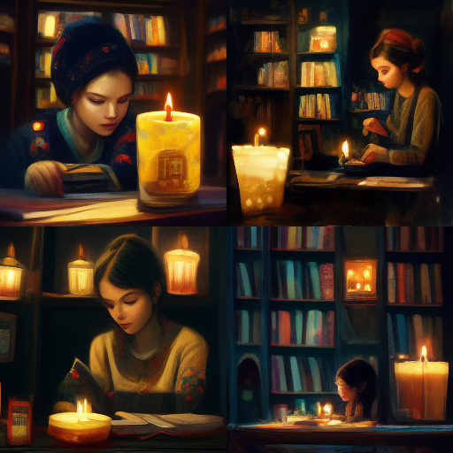
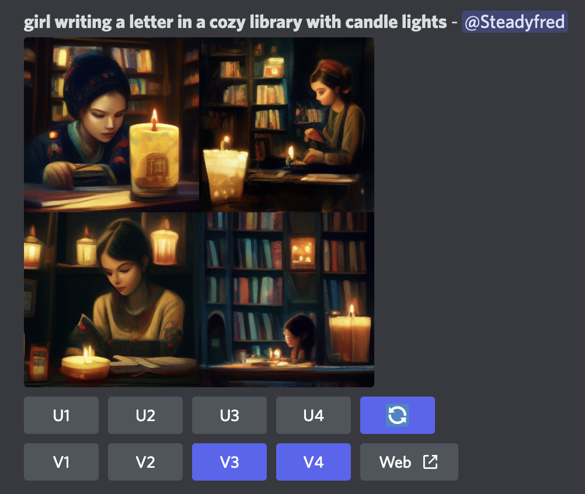

# 붓을 든 AI

얼마전에 평소와 같이 유튜브를 돌아다니다가 영상 추천에 AI가 그린 그림들을 소개하는 영상을 보고 적잖이 충격을 받은 기억이 있습니다. "이제 진짜로 AI가 창의력도 넘보는 걸까?"라고 의심하게 만들 정도로 영상에서 보여준 AI가 그린 그림들은 정확하고 정교했습니다.
그 때의 충격이 아직 가시지 않아 오늘은 잘 알려진 AI 아티스트들 중 두 AI를 소개해 볼까 합니다. 

## 달리 2 (DALL•E 2)

{:.centered}

OpenAI사의 DALLE2 소개영상

OpenAI 사의 작품 중 하나로, DALL•E 2는 이전 AI 화가 DALL•E 의 후속작 입니다. DALL•E 2는 사람이 원하는 장면이나 작품 설명을 텍스트 형식으로 입력 하면, 그에 맞는 이미지를 자동으로 추출해주는 AI 입니다. 예를 들어 달리 2 에게 

>"우주에서 고양이들과 농구하고 있는 우주비행사의 모습을 수채화로 그려줘! (An astronaut playing basketball with cats in space in watercolor style)
{:.lead}

라고 입력을 주면, 다음과 같은 결과물들을 그려줍니다.

{:.centered}

{:.centered}

출저: <a href="https://openai.com/dall-e-2/#demos">OpenAI 웹사이트</a>

좀 소름돋을 정도로 놀라운 디테일과 정확도를 자랑합니다.

달리2는 이미 만들어진 이미지를 수정도 할 수 있습니다. 이미지 안의 위치와 원하는 편집 요소만 설명해주면, 달리2가 알아서 그림을 수정해 줄 수도 있습니다. 예를 들어 아래 두 예시에는 왼쪽에 있는 이미지가 원본 이미지입니다. 달리2에게 1번에 코기를 넣고 싶다하면, 1번위치가 그림 내에 있다는 것을 인식하고 수채화 스타일의 코기를 그림 안에 넣어줍니다. 만약 3번에 코기를 넣고 싶다고 달리2에게 요청하면, 달리2가 배경적으로 전시관 공간을 인식하고 실제 코기 모습으로 수정을 해줍니다. 달리2 공식 웹사이트를 가시면 더 많은 예시들을 볼 수 있으니 한 번 방문해보시는 것을 추천드립니다.

{:.centered}
{:.centered}

출저: <a href="https://openai.com/dall-e-2/#demos">OpenAI 웹사이트</a>

또 한가지 흥미로운 점은 OpenAI사에서 인공지능 윤리를 지키기 위해 달리 2에게 몇가지 제한을 걸어두었다는 점입니다. 먼저, OpenAI사는 사용자들이 달리2로 폭력적, 정치적, 또는 선정적인 이미지를 만들지 못하게 제한을 걸어두었습니다. 애초에 달리 2를 훈련시킬 때 이런 자극적인 이미지들을 배척하고 훈련을 진행했다고 합니다. 두번째로는 달리2 내에 특수한 알고리즘을 주입시켜 유명인사들을 포함한 개인 사람 얼굴 이미지를 그릴 수 없게 만들어 놓았다고 합니다. 사실 이 기술을 보면서 제일 걱정되었던 부분이었는데 조금은 안심이 들기도 합니다. 

달리2를 한번 사용해보고 싶다면, 아쉽게도 현재는 베타 테스트 단계라 대기 리스트에 줄을 서야 합니다. 등록을 하고 싶다면 다음 링크를 통해 리스트에 등록하실 수 있습니다 [(베타 테스터 대기명단 등록하기)](https://labs.openai.com/waitlist). 하지만 다음 소개해드릴 AI 화가는 디스코드 계정만 있다면 누구나 사용해 볼 수 있는 AI입니다.

## 미드저니 (Midjourney)

Midjourney 웹사이트 (이미지를 클릭하면 웹사이트로 이동합니다)</a>

미드저니도 달리2와 작동방식이 거의 비슷합니다. 원하는 그림을 텍스트로 입력해주면 미드저니가 알아서 그림을 그려주는 형식입니다. 미드저니도 달리2 못지 않은 퀄리티를 보여줍니다.

> 빈 배경에 있는 수빅 소파 (watermelon sofa with empty background)
{:.lead}

{:.centered}

> 양촛불로 밝혀진 아늑한 도서관에서 편지를 쓰는 여자아이 (girl writing a letter in a cozy library with candle lights)
{:.lead}

{:.centered}

미드저니의 특징은 텍스트를 입력하면 각기 다른 구도, 스타일의 네 이미지를 만들어 줍니다. 그리고 각 이미지를 크게 만들수도 (upscale) 아니면 마음에 드는 이미지 하나를 골라 비슷한 스타일로 재창조 할 수도 있습니다 (variation). 

{:.centered}

Discord 내의 midjourney UI: U1-4는 업스케일링 버튼, V1-4는 변형 버튼.</a>

미드저니의 자세한 사용법은 [이 포스팅](2022-07-30-midjourney-manual.md)에 설명해놓았으니 사용하고 싶으시다면 포스팅을 따라 실행하시면 됩니다. 무료 베타버전은 한 계정당 **최대 20장**까지만 생성 가능하다는걸 참조해 두시면 좋을것 같습니다. 
 

## 마무리
어떠신가요? 기술의 미래에 가슴이 뛰나요, 아니면 두려우신가요? 저는 양가적인 감정이 드는 것 같습니다. 이런 저세상 AI 신기술들이 하나 둘씩 세상 밖으로 빛을 볼 때마다 어떻게 저런 걸 만들었을까 감탄하는 동시에 기계가 과거에는 넘볼 수도 없었던 창의성마저 결국 기계한테 자리를 내주는 건가 라는 생각도 동시에 듭니다. 인간이 만드는 작품들과 인공지능이 만드는 작품들의 경계선이 점점 모호해지는 사회에 살고 있는 우리에게 이 기술들이 어떤 식으로 우리의 삶을 바꾸게 될 지 미리 맛보기를 보여주는 듯 합니다. 