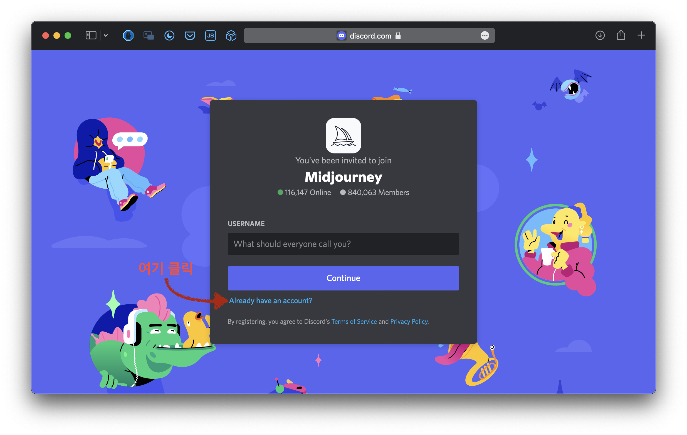
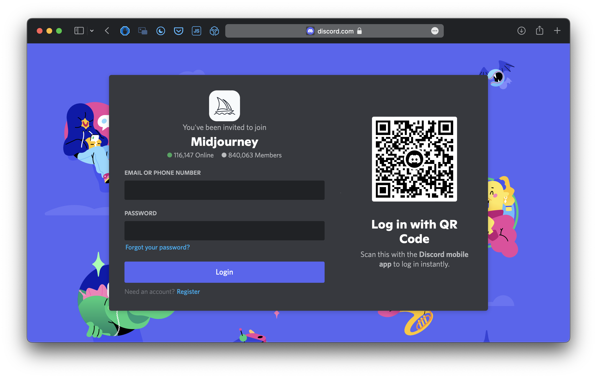
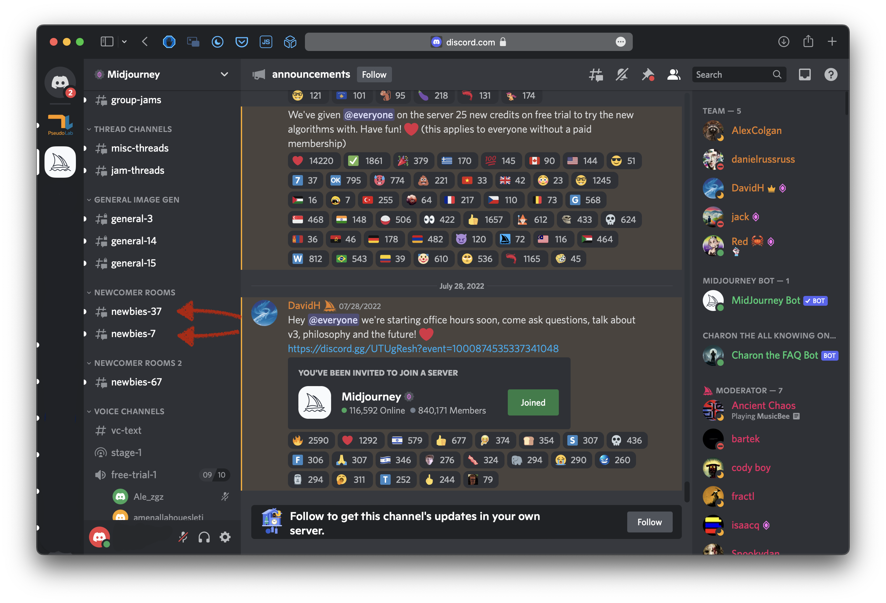
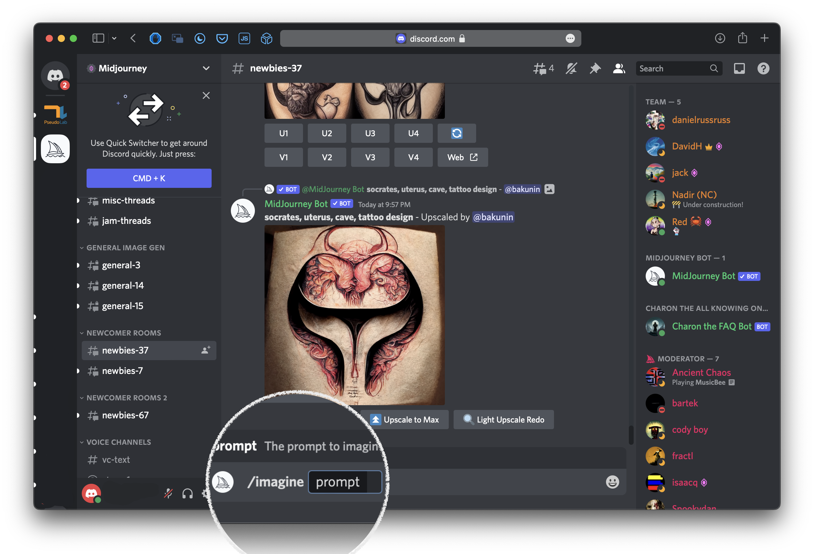
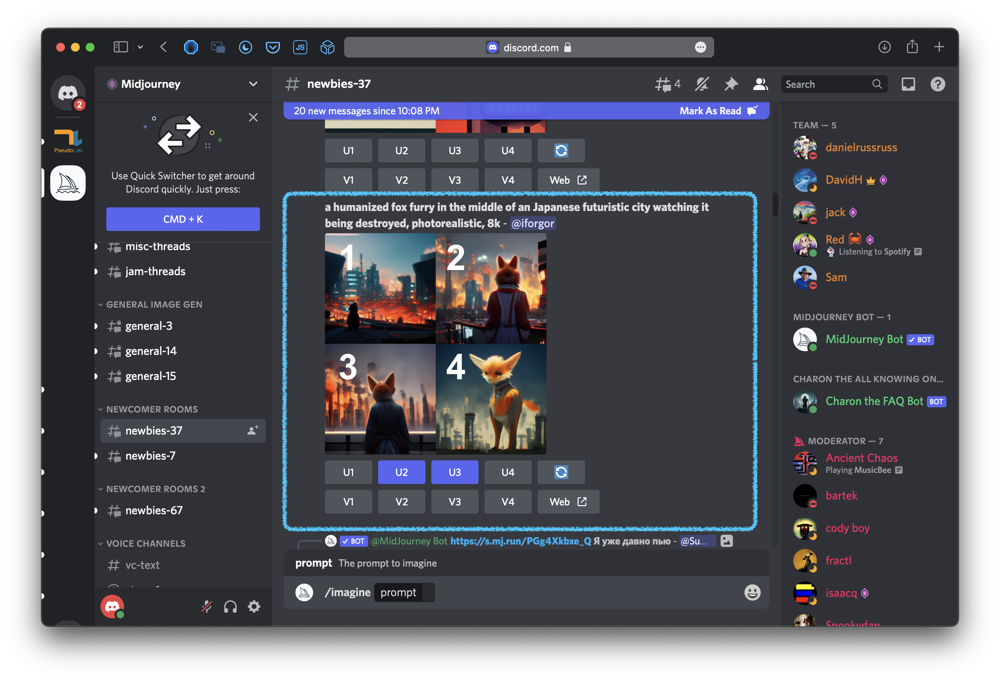
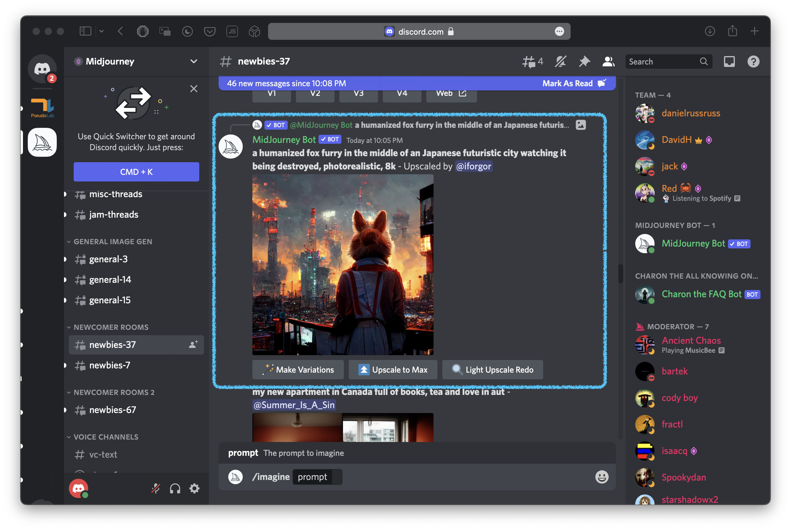

# Midjourney 베타 가입과 사용 방법
1. 먼저 [여기서](https://discord.com/register?redirect_to=%2Fchannels%2F%40me) Discord 계정을 만듭니다. 
2. 다음, [Midjourney](https://www.midjourney.com/) 웹페이지에 들어가서 Join the beta버튼을 클릭합니다.
3. 다음과 같은 창이 뜨면 "Already have an account?"를 누릅니다.

4. 다음, 아까 만든 Discord 계정을 입력해 로그인 합니다.

5. Discord에 로그인이 되면 사이드 메뉴에서 스크롤릉 내리면 newbie로 시작되는 방들이 많이 있는걸 확인할 수 있습니다. newbie로 시작되는 방 아무거나 들어가도 됩니다.

6. 방에 들어가서 채팅창에 `/imagine`을 입력하고 스페이스바를 누릅니다. 그런 다음 상상하고 있는 이미지를 글로 써서 입력해줍니다.
   

7. Enter를 누르면, 이미지가 서서히 처리되는걸 확인할 수 있습니다. 이미지 처리가 완료되면 채팅창 맨 밑으로 이미지가 내려가고 다음과 같은 UI가 나옵니다

여기서 U1-4는 선택한 이미지를 더 크게 만들어주는 업스케일링 버튼이고, V1-4는 선택한 이미지와 느낌이 비슷한 이미지들을 새로 만들어주는 변형 버튼입니다. 예를 들어 두번째 이미지가 마음에 들어 확대해서 보고 싶으면 U2버튼을 누르면 됩니다.

