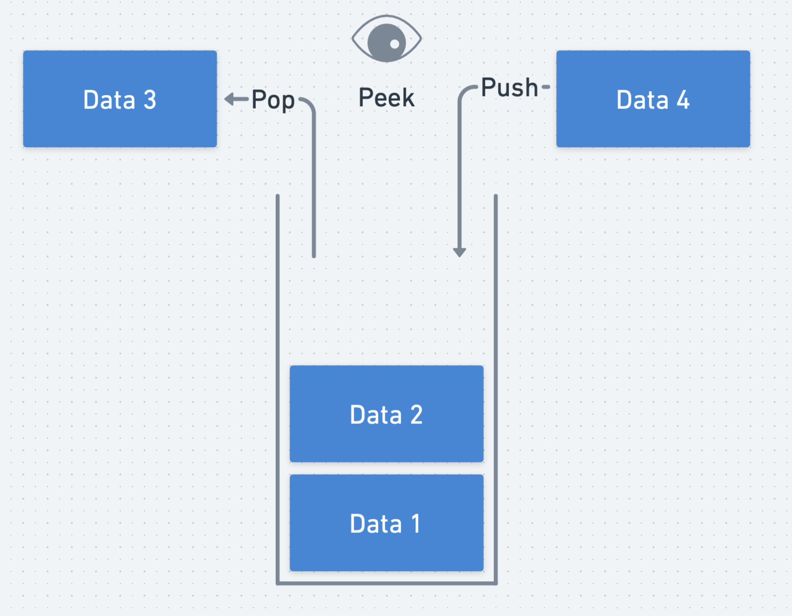
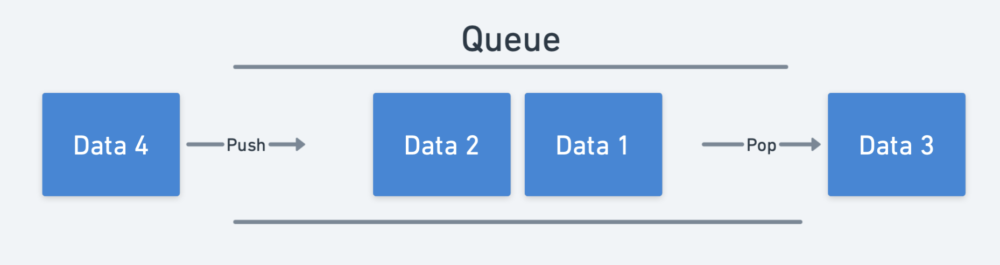

# 스택과 큐 (Stack and Queue)

## 스택 (Stack)


- 스택은 알고리즘에서 자주 쓰이는 자료구조로 책을 차곡차곡 쌓는것과 같은 구조로 이루어져 있다. 스택에 데이터를 추가할 때는 기존에 있는 데이터에 쌓기만 가능하다. 위의 그림에서 Data4를 Data2 다음으로 쌓을 수는 있지만, Data 1 밑으로 삽입은 불가능하다. 또한, 데이터를 참조하거나 삭제할 때는 가장 마지막에 삽입된 데이터만 참조/삭제할 수 있다. 
- 이러한 스택의 구조 때문에 스택 구조는 FILO (First In Last Out: 선입 후출)구조라고도 불린다. 스택에 데이터를 삽입하는 과정을 **push**라고 하고 데이터를 꺼내는 작업을 **pop**이라고 한다. 또한 스택의 가장 위에 있는 값을 참조하는 것을 **peek**라고 한다.

## 큐 (Queue)

- 큐는 스택 구조와 다르게 데이터가 구조 앞뒤로 삽입/제거가 가능하다. 큐를 공장의 컨베이어벨트와 비슷하게 생각하면 이해가 쉬워진다. 컨베이어벨트가 돌아가는동안 작업자가 물류를 한 상자씩 올리면 그 상자는 벨트를 타고 계속 흘러가기 된다. 물류가 벨트 끝에 다다르면 물류가 벨트에서 떨어지게 된다. 이런식으로 데이터를 구조 끝에서 넣어주고 앞에서 출력/참조하는 구조를 큐라고 한다. 
- 큐에 자료를 삽입하는 과정을 **enqueue**라 하고 앞에서 자료를 빼는 과정을 **dequeue**라 부른다. 

## 알고리즘 문제

### 기능개발

[문제 링크](https://programmers.co.kr/learn/courses/30/lessons/42586)

- 문제에서 progresses는 작업이 배포되어야 하는 순서대로 나열이 되있다. 인덱스가 0인 부분부터 완료되는 대로 배포가 되는 구조임으로 progresses를 스택으로 놓고 풀면 된다. 

- 먼저 모든 작업들이 배포 될 때까지 (progresses 리스트가 다 비워질 때까지) while 문을 돌린다. while 반복문을 돌릴 때 마다 각 progresses값들을 각 인덱스의 speed만큼 더해준다. 
- 모든 progresses값들을 업데이트 해준 뒤 progresses의 맨 앞부터 100이 되거나 100보다 큰 값들이 있는지 확인하고 몇개가 있는지 센다. 
- 작업이 완료된 값들은 progresses에서 pop해주고 그에 맞는 speeds값들도 같이 speeds에서 pop 해준다.

**소스코드**
  ```python
  def solution(progresses, speeds):
    answer = []
    while len(progresses)>0:
        for i in range(len(progresses)):
            progresses[i] += speeds[i]

        cnt = 0
        for j in progresses:
            if j >= 100:
                cnt += 1
            else:
                break
        if cnt > 0:
            answer.append(cnt)
            for k in range(cnt):
                progresses.pop(0)
                speeds.pop(0)
    return answer
  ``` 

## 