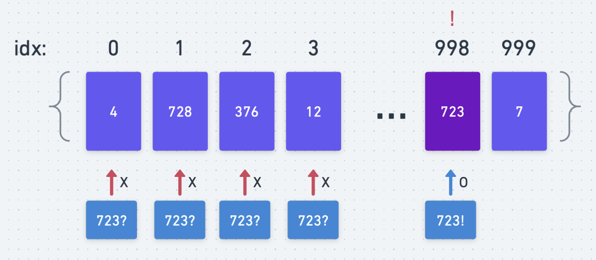
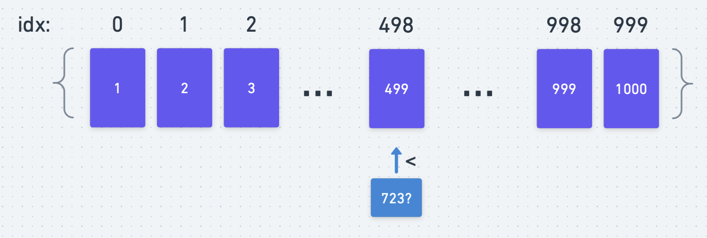

# 완전 탐색과 이중 탐색 (Exhaustive Search/Binary Search)

## 완전 탐색
- 완전 탐색은 말 그대로 문제가 주어졌을 때 모든 경우의 수를 탐색해보는 알고리즘이다. 예를 들어 1부터 10,000이 랜덤으로 담겨있는 리스트에서 723이 담겨있는 인덱스를 찾으라는 문제가 있으면 완전 탐색 알고리즘은 리스트의 맨 처음부터 시작해서 각 인덱스에 있는 값을 비교해가며 문제를 풀 것이다. 



- 하지만 보다시피 완전탐색은 언제나 정확한 값을 찾을 수 있지만, 효율성이 떨어진다. 모든 경우의 수를 탐색한다는 점에서 불필요한 연산/비교를 수없이 하게 된다. 이런 효율성 문제를 해결하기 위해 여러 종류의 더 효율적인 알고리즘들이 개발되었다.

## 이중 탐색 
- 다양한 탐색 알고리즘 중 이중 탐색이라는 알고리즘이 있다. 이 알고리즘의 핵심을 답을 찾을 배열이 다 정렬이 되어 있다는 전재다. 



- 먼저 배열의 중앙에 위치한 값을 찾고 찾고자 하는 값이 배열의 중앙의 있는 값보다 크면 배열의 우측을 탐색하고, 작으면 배열의 좌측을 탐색하는 방식을 활용한다. 배열의 반을 버리고 남은 배열 값에서 위와 동일한 방법으로 중앙값을 찾고 비교하는 일을 값을 찾을 떄까지 실행한다.

## 알고리즘 문제 예시

### 모의고사 (완전탐색)

[문제 링크](https://programmers.co.kr/learn/courses/30/lessons/42840)

- 문제를 찍을 때, 각 수포자들은 다음과 같은 패턴으로 답을 찍는다.
  
```
수포자 1: 1 2 3 4 5 1 2 3 4 5 ... 
수포자 2: 2 1 2 3 2 4 2 5 2 1 ...
수포자 3: 3 3 1 1 2 2 4 4 5 5 3 3 1 1 ...
```
- 각 수포자마다 반복되는 패턴을 찾을 수 있다

```
수포자 1: 12345 반복
수포자 2: 21232425 반복
수포자 3: 3311224455 반복
```

- 정답 배열 answers가 주어졌을 때 각 수포자들이 어떤 식으로 정답을 찍었는지 알아내려면, answers 길이만큼 각 수포자들의 패턴을 반복시켜주면 된다. answers의 길이 와 각 수포자들의 패턴을 나누면 몫과 나머지가 나온다. 패턴을 그 몫만큼 반복시켜주고 거기다가 패턴의 앞부분부터 나머지만큼의 문제 수를 더해주면 패턴 반복을 answers의 길이만큼 만들 수 있다. 
  - 수포자 2를 예로 들면, 수포자 2의 패턴 길이는 8이다. answer의 길이가 13이라 하면, `13//8 = 1`이고 `13%8 = 5`이다. `21232425`를 한번 반복시키고 그 뒤에 `21232` 5자리를 붙여주면 수포자 2가 13문제를 어떻게 찍었는지 알 수 있다. (`2123242521232`)

- 각 수포자마다 문제를 어떻게 찍었는지를 알고 나면, 각 수포자마다 정답값(answers)을 대조해보며 누가 가장 많이 문제를 맞췄는지 알 수 있다.

- **소스코드**
  
```python
def solution(answers):
    pattern = ['12345', '21232425', '3311224455']
    answer_str = ''.join([str(i) for i in answers])
    result = []
    winner = []
    for i in range(3):
        len_pat = len(pattern[i])
        len_ans = len(answers)
        result.append(pattern[i]*(len_ans//len_pat)+pattern[i][:len_ans%len_pat])
    
    for r in result:
        cnt = 0
        for j in range(len(answer_str)):
            if r[j] == answer_str[j]:
                cnt += 1
        winner.append(cnt)
    

    win = []
    for i in range(len(winner)):
        if winner[i] == max(winner):
            win.append(i+1)
    return win
```

### 소수 찾기 (완전탐색)

- [문제 링크](https://programmers.co.kr/learn/courses/30/lessons/42839)

