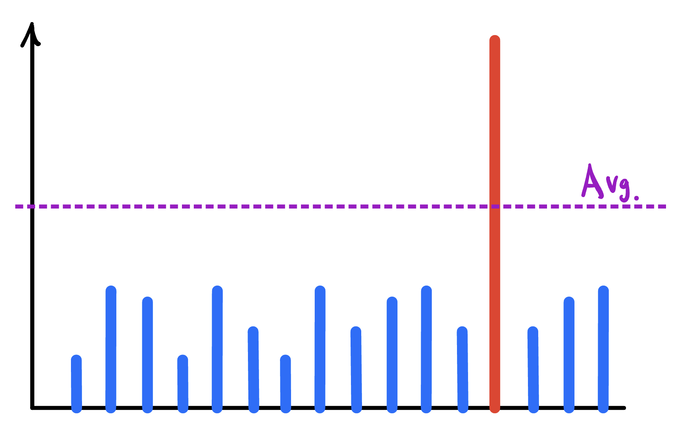

* tableofcontents
{:toc}

## 통계 
- 통계가 열어준 데이터의 시대
  - 통계 > 데이터 마이닝 > 빅데이터 > AI

- 데이터 수집 및 처리
- 분석 툴
- 시각화

## 데이터의 이해

### 변수와 변수의 종류
- 변수: 통계학에서의 변수는 관측되거나 수집된 자료값들을 변수라고 칭합니다. 그리고 여러 변수들이 모여 하나의 자료(Data)를 생성합니다.
  - 예를 들어, 학교 전체 학생들의 인적사항들을 모아둔 값들을 자료(Data)라고 할 수 있고, 인적 사항의 세부 사항들 (성별, 이름, 나이, 키, 학년 등)을 각각 자료의 변수라고 할 수 있습니다.
- 변수는 크게 두 종류로 나뉠 수 있습니다. 
  - 질적 변수(Qualitative Variable): 데이터를 몇 개의 범주로 구분하여 표현할 수 있는 데이터를 의미합니다
    - 명목형 변수 (): 
    - 순서형 변수 ()
  - 양적 변수(Quantitative Variable): 데이터가 숫자로 표현되는 데이터 입니다.
    - 이산형 변수 (discrete variable): 숫자가 딱딱 끊어지는 경우 (ex. 점수, )
    - 연속형 변수 (continuous variable): 실수 데이터

### EDA (Exploratory Data Analysis)
- 데이터를 분석하는 과정으로, 도표, 그래프, 요약통계 등 다양한 방법들을 사용하여 데이터를 체계적으로 분석하는 과정입니다.
  - EDA를 활용하면
    - 데이터를 심층적으로 분석 하여 초기에 가설을 세울 수 있기 용이하게 됩니다.
    - 데이터에 적합한 모델과 기법 선정에 도움을 줍니다.
    - 변수 간의 패턴, 연관성 등을 통계적 기반에 평가할 수 있습니다.
    - 방대한 데이터에 숩겨져 있는 이상치를 찾아내거나 데이터에서 부족한 부분들을 찾아내 추가적으로 데이터 수집을 할 수 있게 도와줍니다.

### 데이터 시각화
- 앞서 소개한 EDA에 대표적으로 사옹되는 방법은 데이터 시각화(Data Visualization)입니다.
- 방대한 데이터들을 시각화 하여 데이터 패턴과 연관성을 보기 쉽게 설명해준다는 장점이 있습니다.
- 데이터 시각화 방식은 다음과 같이 구분할 수 있습니다.
  - 시간 시각화: 
  - 분포 시각화: 
  - 관계 시각화: 두 개 이상의 변수의 연관성을 시각화해주는 방식입니다.
  - 비교 시각화: 
  - 공간 시각화
- 

{:.centered width="600" loading="lazy"}

- 데이터가 가지고 있는 스토리를 효과적으로 전달하는 것이 중요합니다.
- 
출저: [infogram](https://infogram.com/page/data-visualization)
{:.figcaption}

## 데이터의 기초 통계량
- 기초 통계량(Statistics)은 주어진 데이터의 표본들로 산출한 값들입니다. 
- 통계량을 통해 데이터가 가지고 있는 특성들을 이해할 수 있습니다. 

### 중심경향치
- 데이터의 중심이 어디에 있는지를 설명하는 값입니다.
- 보통 평균을 사용하는 것에 익숙해져 있지만, 평균이 데이터를 잘 설명해주자 못하는 경우도 많습니다.
  - 예를 들어, 아래 도표과 같이 연봉 데이터 내에 특정 사람의 연봉이 눈에 띄게 높은 경우기 있다면, 평균값을 냈을 떄 평균 값이 전체 데이터 충분히 설명해주지 못하는 경우가 발생합니다.
{:.centered width="500" loading="lazy"}
- 다양한 데이터들의 중간값을 잘 표현하기 위해 중앙값, 최빈값, 절사 평균 등과 같이 각 데이터에 알맞은 중심경향치를 사용해야 합니다.

#### 평균 (mean)

$$ \overline{X} = \frac{x_1+x_2+ ... +x_n}{n} = \frac{1}{n} \sum_{i+1}^n x_i$$

#### 중앙값 (median)
- 표본의 관측치들을 크기 순으로 나열 했을 때, 딱 중앙에 위치하는 값을 의미합니다.
- 관측치를 크기 순으로 $$x_1, \; x_2, \;x_3, ... x_n$$ 나열했을 때 중앙값은 다음과 같습니다.

$$
\begin{equation}
  median =
    \begin{cases}
      x_{k+1} & n=2k+1\\
      \frac{x_k+x_{k+1}}{2} & n=2k\\
    \end{cases}       
\end{equation}
$$

- 예를 들어, $$80, 81, 83, 85, 90, 91, 100$$ 이라는 홀수 개의 데이터가 있다면, 이 데이터의 중앙값은 정중앙에 있는 $$85$$가 됩니다.
- 다른 예로, $$80, 81, 83, 84, 85, 90, 91, 100$$ 이라는 짝수 개의 데이터가 있다면, 이 데이터의 중앙값은 $$84$$와 $$85$$사이에 있는 $$84.5$$가 됩니다.

#### 최빈값 (mode)
- 관측치 중에서 가장 많이 관측되는 값입니다. 

#### 평균, 중앙값, 그리고 최빈값의 관계
- 평균, 중앙값, 그리고 최빈값의 크기를 비교해봄으로써, 데이터의 분포도를 추측할 수 있습니다.
  - 평균, 중앙값, 그리고 최빈값이 모두 같으면 데이터는 대칭 분포를 만듭니다.
  - 중앙값이 최빈값보다는 크지만, 평균보다는 작으면, 왼쪽으로 쏠리는 분포를 만듭니다.
  - 반대로, 중앙값이 최빈값보다는 작지만, 평균보다는 크면, 오른쪽으로 쏠리는 분포를 만듭니다.

{:.centered width="800" loading="lazy"}
출저: [Quora](https://brunch.co.kr/@edte1020/14)
{:.figcaption}

### 산포도 (Dispersion)
- 산포도는 데이터가 어떻게 산포(분포)되어 있는지를 나타내는 수치들입니다.
- 대표적으로 범위, 사분위수, 분산, 표준편차, 변동 계수 등이 있습니다.
#### 범위 (Range)
- 데이터의 최대값과 최소값의 차이를 의미합니다. (데이터가 어디서부터 어디까지 분포되어 있나)
#### 사분위수(quartile)
- 전체 데이터를 오름차순으로 정렬하여 4등분을 했을 때, 첫번째로 나누어 지는 부분을 제 1사분위수 $$(Q1)$$, 두번째를 제2사분위수$$(Q2)$$, 그리고 세번째를 제3사분위수 $$(Q3)$$라고 합니다.
- 사분위수 범위(interquartile range): $$IQR = Q3-Q1$$

{:.centered width="800" loading="lazy"}
출저: [Sigma Magic](https://www.sigmamagic.com/blogs/what-are-quartiles/)
{:.figcaption}

#### 백분위수(percentile)
- 백분위수는 데이터를 오름차순으로 정렬했을 때 주어진 비율로 등분한 값을 의미합니다. 제 $$p$$백분위수는 $$p$$에 위치한 지료값입니다. (ex: 75백분위수는 $$75\%$$에 위치한 자료값)
- 자료가 $$n$$개 있을 떄 제 $$(100 \times p)$$백분위수는 

{:.centered width="500" loading="lazy"}
출저: [Timescale](https://www.timescale.com/blog/how-percentile-approximation-works-and-why-its-more-useful-than-averages/)
{:.figcaption}

###  분산과 표준 편차 (Variance and Standard Deviation)
- 분산은 데이터가 평균을 중심으로 얼마나 분포되어 있는지를 나타내는 수치입니다.
- 표
#### 표본분산과 표본 표준 편차
- 표본 분산과 표본 표준 편차는 모집단에서 샘플링한 데이터들의 분산을 나타내는 수치입니다.
- 표본 분산은 다음과 같은 공식을 가집니다.

$$var=\frac{1}{n-1}\sum_{i_1}^n(x_i-\bar{x})^2$$

- 표본 표준 편차는 표본 분산의 제곱근입니다.

$$s = \sqrt{var}= \sqrt{\frac{1}{n-1}\sum_{i_1}^n(x_i-\bar{x})^2}$$

#### 모분산과 모표준편차
- 모분산과 모표준 편차는 모집단전체의 분산을 나타내는 수치입니다.

$$ \sigma^2=\frac{1}{N}\sum_{i_1}^n(x_i-\mu)^2$$

$$ \sigma = \sqrt{\sigma^2} = \sqrt{\frac{1}{N}\sum_{i_1}^n(x_i-\mu)^2}$$

### 변동 계수 (Coefficient of Variance: CV)
- 표본 변동 계수

$$
CV=\frac{s}{\bar{x}}
$$

- 모변동 계수

$$
CV=\frac{\sigma}{\mu}
$$