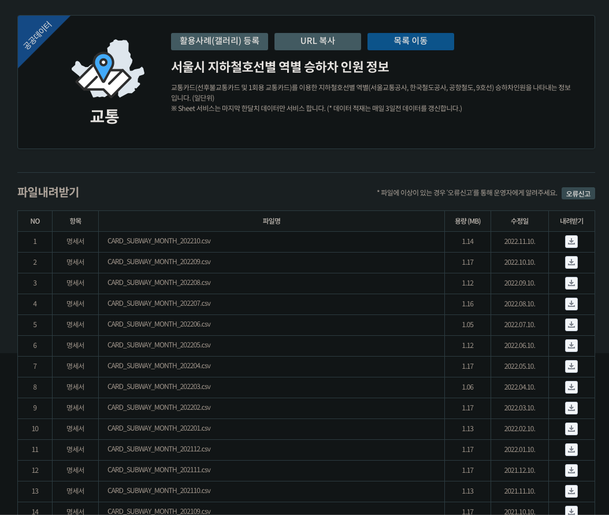
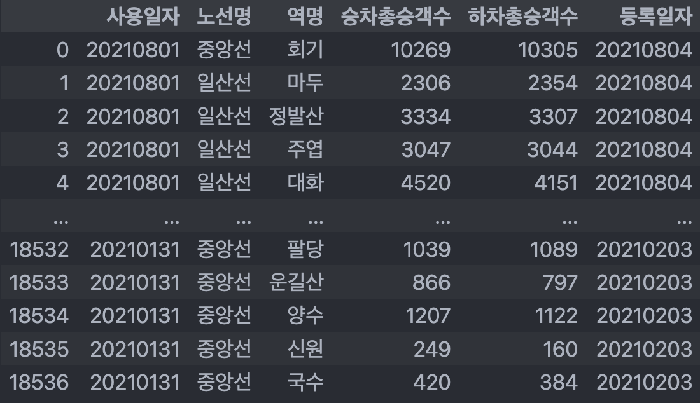
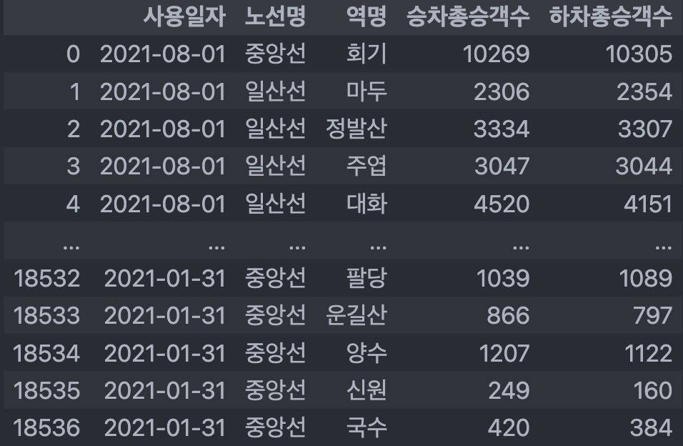
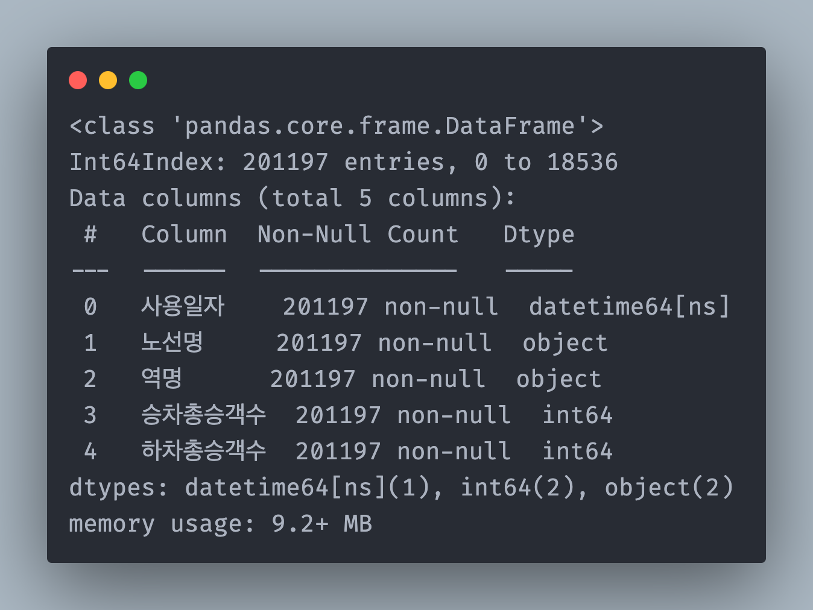
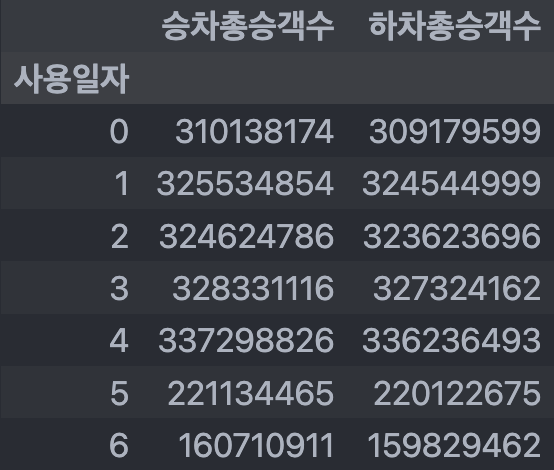
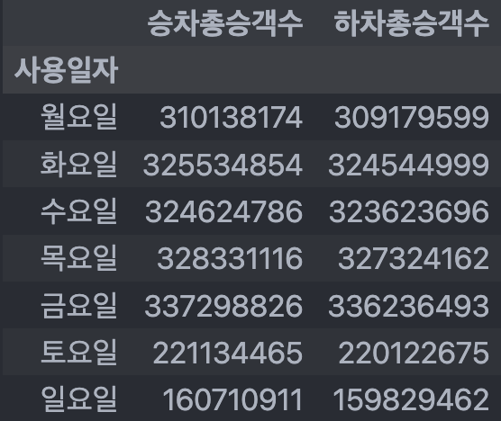
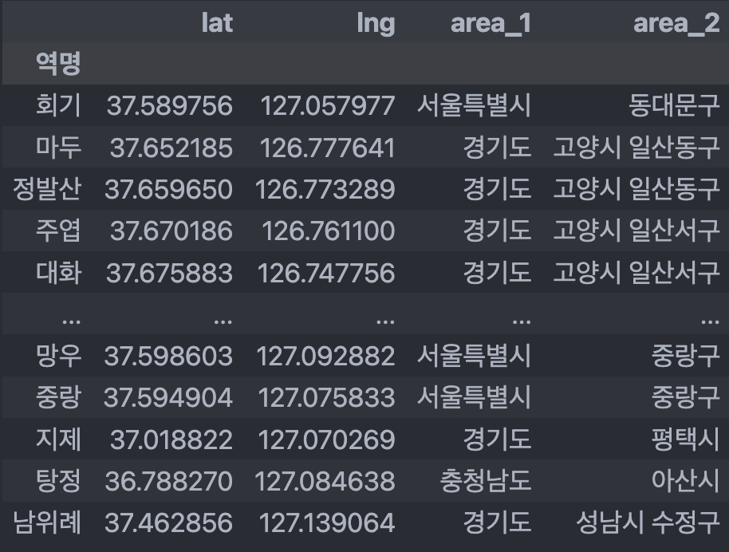
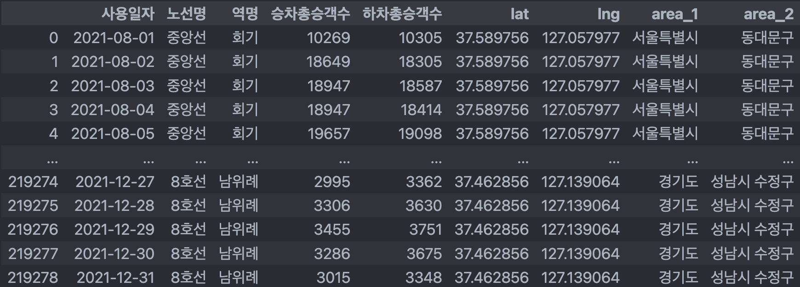
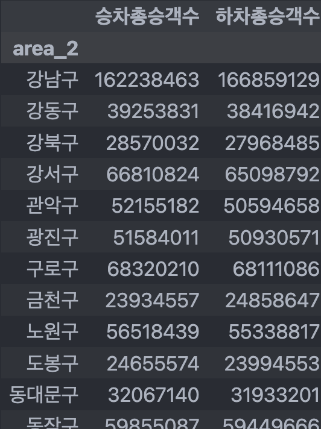
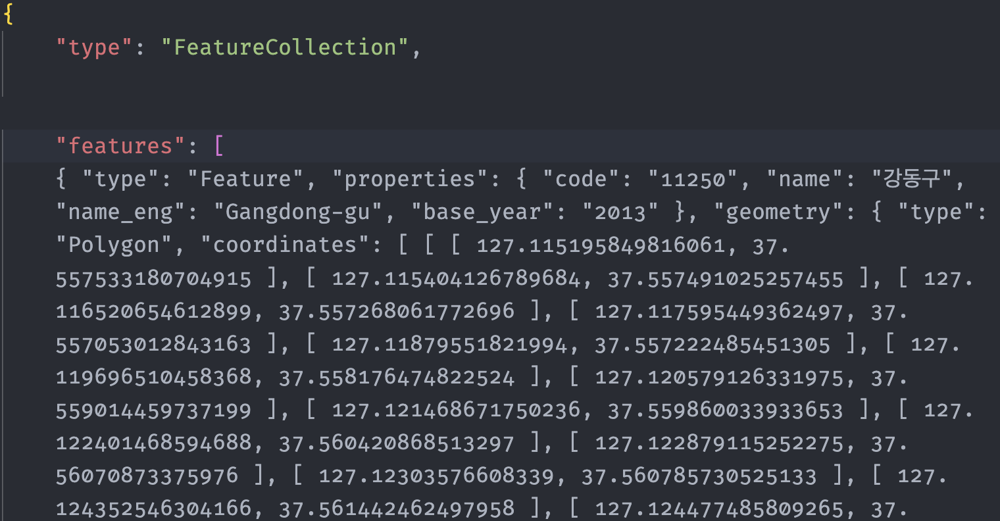

* toc
{:toc}

## 배운 것
- pandas DataFrame 사용법
- EDA 방식
- Google Maps API 활용 방식
- matplotlib를 활용한 데이터 시각화
- 지도 시각화

## 프로젝트 개요
- 이번 프로젝트에서는 부트캠프 EDA/시각화 강의에서 배운 기술을 사용하여 서울 지하철 이용 데이터를 분석해보고자 합니다. 원본 데이터를 분석하면서 다음과 같은 분야을 알아보고자 합니다.
  - 어떤 요일에 지하철을 가장 많이 이용하는지
  - 어떤 달에 지하철을 가장 많이 이용하는지
  - 무슨 노선을 가장 많이 이용하는지
  - 어떤 구에서 가장 많이 타고 내리는지
  - 지도 시각화

## 데이터 준비하기
- 먼저, [서울 열린데이터 광장](https://data.seoul.go.kr/dataList/OA-12914/S/1/datasetView.do)에서 서울시 지하철호선별 역별 승하차 인원 정보 데이터를 csv형태로 다운을 받습니다. 파일명의 끝을 보면 해당 데이터가 어떤 년도외 월 데이테인지를 알 수 있습니다. (202101부터 202210까지 데이터를 다운받습니다.)



- 데이터를 다 다운받은 뒤, 2021과 2022년 데이터를 구분하여 directory에 저장해 줍니다.

## csv파일을 `pandas.DataFrame`으로
- 먼저, csv파일이 저장되어 있는 경로들을 `glob` 모듈을 사용하여 한번에 불러오고 리스트에 저장합니다. 
- 모든 2021 데이터들을 저장할 빈 DataFrame을 만들고 경로 리스트를 for loop으로 돌면서 데이터를 추가합니다.

```python
import glob
data_lst = glob.glob('./data/2021/**')

df_subway = pd.DataFrame()

for lst in range(len(data_lst)):
    df_tmp = pd.read_csv(data_lst[lst], index_col=False, encoding='utf-8')

    df_subway = pd.concat([df_subway, df_tmp], axis=0)
```
- 하지만, 위 코드를 돌리면 2021년 11월 데이터에서 다음과 같은 에러가 나옵니다.


- 위 에러는 csv파일이 6개의 컬럼을 가지고 있지만, 12658번째 열에 7개 컬럼의 데이터가 존재해서 데이터를 불러올 수 없다는 에러입니다. csv파일을 직접 열어서 확인해보면 다음과 같이 역명 앞에 불필요한 숫자 데이터가 끼어 있는 것을 확인할 수 있습니다.


- 문제가 있는 파일을 다음과 같은 절차로 전처리를 해줍니다.
  - 원본 파일과 새 csv파일을 동시에 열고, 
  - 원본 파일에 있는 행들을 읽으면서 행에 있는 데이터가 7개면, 세번째 데이터를 지우고, 
  - 새 csv파일에 변형된 행을 다시 써줍니다.
  - 원본 파일에 있는 행들의 데이터가 6개이면, 그대로 새 csv 파일에 써줍니다.

```python
with open(data_lst[4]) as f_in, open('./data/2021/CARD_SUBWAY_MONTH_202111_out.csv', 'w') as f_out:
    # 컬럼 명은 그대로 옮겨줍니다.
    header = f_in.readline()
    f_out.write(header)
    
    # 원본 파일을 읽으면서...
    for line in f_in:
        data = line.strip().split(',') # 각 줄에 있는 데이터를 쪼개줍니다
        if len(data) == 7: # 데이터 수가 7개면, 두번째 데이터를 지움니다.
            del data[2]
        new_line = ','.join(data) # 새 데이터를 새 파일에 씁니다.
        new_line += '\n'
        f_out.write(new_line)
```

- 위 데이터 전처리 후, df_subway라는 DataFrame을 성공적으로 만들 수 있는 것을 확인할 수 있습니다.

{:.centered width="500"}

- 등록일자는 이번 프로젝트의 데이터 분석에 필요가 없음으로, 등록일자 컬럼을 지워줍니다.

```python
df_subway.drop(['등록일자'], axis=1, inplace=True)
```

## 사용일자 datetime컬럼으로 변경하기
- 데이터를 시간별로 분석하기 위해 사용일자 컬럼의 문자열들(20210292, 20211110등)을 쪼개서 새로운 달(month)컬럼을 만들어서 분석할 수 있습니다. 하지만, 사용일자 컬럼 데이터 타입을 `pandas datetime`으로 변형하면, 더욱 손쉽게 데이터를 시간별로 분석할 수 있습니다. 
- 컬럼 데이터를 datetime형식으로 바꾸는 건 다음과 같은 코드로 바꿀 수 있습니다. format 파라미터에 '%Y%m%d'는 원본데이터에 있는 날짜 형식이 어떤 형식으로 포맷되어있는지를 알려주는 파라미터값입니다. 자세한 format 리스트는 다음 [링크](https://dataindependent.com/pandas/pandas-to-datetime-string-to-date-pd-to_datetime/)에서 확인할 수 있습니다. 이 DataFrame의 경우, %Y는 네자리 수 연도(2021, 2022...), %m은 두자리 수 월(01, ..., 12), 그리고 %d는 두 자리 수 일(01, ..., 31)을 나타냅니다.

```python
df_subway['사용일자'] = pd.to_datetime(df_subway['사용일자'], format='%Y%m%d')
```

- 모든 과정을 끝마치면, 다음과 같은 DataFrame을 얻을 수 있습니다.

{:.centered width="500"}

- `df_subway.info()`를 활용하여 사용일자가 제대로 datetime형식으로 바뀌고, 모든 데이터가 null값 없이 채워진 것을 확인할 수 있습니다.

{:.centered width="500"}

## 요일별로 분석
- 먼저, 시간별 분석을 위해, 위에서 생성된 `df_subway` DataFrame의 '사용일자'컬럼을 인덱스로 설정해 줍니다.
- 그리고, pandas의 `pivot_table` 기능을 이용해, 요일별로 지하철 이용객 수를 합해줍니다. index 파라미터에 `df_subway.index.weekday`를 입력하면, 간편하게 요일별로 이용자들을 그룹화할 수 있습니다.

```python
df_subway.set_index('사용일자', inplace=True)
df_sub_weekdays = df_subway.pivot_table(index=df_subway.index.weekday,
                                        values=['승차총승객수', '하차총승객수'],
                                        aggfunc=np.sum)
```

{:.centered width="500"}

- 위 결과를 보면, 사용일자가 일요일 ~ 토요일로 설정되는 대신, 정수로 표현된 것을 확인할 수 있습니다. 가독성을 위해, 사용일자를 정수에 걸맞는 요일로 바꿔줍니다. 
  - [pandas 공식 문서](https://pandas.pydata.org/docs/reference/api/pandas.Series.dt.weekday.html)를 보면, 월요일이 0, 일요일이 6과 연계되 있는 것을 확인할 수 있습니다.
  - 그에 맞게, rename 함수를 이용하여 사용일자 컬럼을 재구성 해줍니다. 

```python
df_sub_weekdays.rename(index=
    {0:'월요일', 1:'화요일', 2:'수요일', 3:'목요일',
     4:'금요일', 5:'토요일', 6:'일요일'}, inplace=True
)
```

{:.centered width="500"}

- 사용일자 컬럼 이름이 요일로 잘 바뀐걸 확인할 수 있습니다.
- 위 데이터로 간단한 시각화를 진행해 보겠습니다. 먼저, `df_sub_weekdays` pivot table을 승차총승객수대로 정렬을 해줍니다.

```python
df_sub_weekdays.sort_values('승차총승객수', inplace=True)
```
- 그런 다음, pandas가 그래프를 웹사이트에 손쉽게 html형식으로 변환해주는 plotly 모듈을 사용하여 그릴 수 있도록 pandas 기본 plotting 모듈을 바꿔줍니다. 

```python
pd.options.plotting.backend = 'plotly'
```

- 이제 마지막으로 시각화를 해줍니다. pandas DataFrame에 바로 plot을 사용하면 plotly로 그래프를 그릴 수 있습니다. 

```python
fig = df_sub_weekdays.plot.barh(facet_row='variable')
fig.write_html("/path/to/website/subway_weekday.html",
               include_plotlyjs="cdn")
```

- 위 과정을 마치면, 아래와 같이 interactive한 요일별 시각화를 완성할 수 있습니다 (마우스를 올리면 각 그래프별 디테일한 값들을 확인할 수 있습니다).



- 위 시각화로, 우리는 지하철 이용객들이 금요일에 지하철을 가장 많이 이용하고, 일요일에 가장 적게 이용하는 것을 확인할 수 있습니다.

## 월별로 분석
- 월별 분석도 요일별 분석과 비슷한 방식으로 진행할 수 있습니다. 요일별 분석과 다른 점은 새 pivot table을 생성할 때, index 값을 `df_subway.index.month`로 설정한다는 점입니다.
- 아래 코드는 월별 분석과 시각화 코드를 한번에 실행하는 코드입니다.

```python
df_sub_month = df_subway.pivot_table(index=df_subway.index.month,
                                     values=['승차총승객수', '하차총승객수'],
                                     aggfunc=np.sum)

fig = df_sub_month.plot.bar(facet_row='variable')
fig.write_html("/path/to/website/subway_month.html",
               include_plotlyjs="cdn")
```



- 위 시각화에서 알 수 있는 점은, 방학과 여행 시즌이 겹쳐있는ㄴ 7-8월과 1-2월에 이용률이 현저히 줄어드는 것을 확인할 수 있습니다. 서울과 서울 근교에 사는 사람들이 휴가 시즌을 맞아 서울 밖으로 나가 지하철 이용이 줄어드는 것을 확인할 수 있습니다.

## 노선별 분석
- 이제 노선별로 어떤 노선이 가장 많이 이용되는지 확인해 보겠습니다. 시간 분석과 마찬가지로, pivot table을 만들어 분석을 시작합니다. 
- pivot table을 생성한 이후, 승차 승객수와 하차 승객수를 합해줍니다. 그리고 노선명과 총 승객수로 시각화를 해줍니다. 

```python
df_sub_lane = df_subway.pivot_table(index=['노선명'],
                                    values=['승차총승객수', '하차총승객수'],
                                    aggfunc=np.sum)

# 총 승객수를 '승차총승객수'컬럼과 '하차총승객수'컬럼을 더해 구합니다.
df_sub_lane['total'] = df_sub_lane['승차총승객수'] + df_sub_lane['하차총승객수']

# 마지막으로 시각화를 진행합니다.
df_sub_lane.sort_values('total', ascending=False, inplace=True)
fig = df_sub_lane[['total']].plot.bar()
fig.write_html("/path/to/website/subway_lane.html",
               include_plotlyjs="cdn")
```



- 위 시각화로 2호선 이용 승객수가 다른 노선에 비해 압도적으로 높은 것을 확인할 수 있습니다.

## 구별 분석
- 구별 분석을 위해, df_subway에 있는 각 역의 위도, 경도 위치가 필요합니다. 역의 위치를 알아오기 위해, Google Maps API를 활용하여 정보를 받아오는 것을 시도해보겠습니다. 
- 먼저, Google Cloud Platfrom에서 구글 지도 api키를 발급합니다. 구글 맵 api키를 받는 과정은 [구글 공식 문서](https://developers.google.com/maps/gmp-get-started?hl=ko#create-project)에서 확인할 수 있습니다.
- Google Cloud Platform에서 받아온 API키를 입력하고 Google Maps API를 아래와 같이 설정해줍니다.
```python
import googlemaps
gmaps_key = 'googlemapapikeyfromgooglecloudplatform'
gmaps = googlemaps.Client(key=gmaps_key)
```

### `merge()`
- 구글 지도 API를 설정한 후, 바로 각 열을 돌려가며 구글 API를 활용할 수 있습니다. 하지만, df_subway에 매일 역명이 반복되어서 불필요한 request를 해야 하는 경우가 생깁니다. request를 최소화하기 위해 역들의 위치 정보를 담는 새 DataFrame을 만든 후, df_subway와 새 DataFrame을 merge 해줍니다. 

{:.centered width="500"}
출저: [Towards Data Science](https://towardsdatascience.com/all-the-pandas-merge-you-should-know-for-combining-datasets-526b9ecaf184)
{:.figcaption}
- 위와 같이 merge를 사용하면, 원본 데이터에 있는 역들에 상응하는 데이터가 원본에 붙게 됩니다.

- 새 DataFrame을 만들고, 역 이름, 위도와 경도 정보를 담아줄 컬럼을 생성합니다. 그리고, 역명 컬럼에 원본 df_subway에 존재하는 모든 역명들을 unique함수로 담아줍니다.

```python
df_subway_geo = pd.DataFrame(
    {'역명': list(df_subway['역명'].unique()),
    'lat': np.nan,
    'lng': np.nan}
)

df_subway_geo.set_index('역명', inplace=True)
```
- 이제 구글 지도 API를 활용하여 각 역의 위도 경도 정보를 불러옵니다. 
- 한국에서는 구글 지도 사용성이 네이버 지도보다는 떨어지기 때문에, API로 데이터를 불러올 수 없는 경우가 있을수도 있습니다. 데이터 불러오기 실패한 역명들을 따로 담아줄 리스트를 만들어, API에러가 나면  예외처리 (`for`, `except`)로 리스트에 담아줍니다.

```python
geo_not_found = []

for idx, rows in df_subway_geo.iterrows():
    station_name = idx.split('(')[0]
    station_name = station_name + '역'
    tmp = gmaps.geocode(station_name, language='ko')
    
    try:
        lat = tmp[0].get('geometry')['location']['lat']
        lng = tmp[0].get('geometry')['location']['lng']
    except:
        geo_not_found.append(idx)
        print('coordinates not found!')
        lat = np.nan
        lng = np.nan
    
    df_subway_geo.loc[idx, 'lat'] = lat
    df_subway_geo.loc[idx, 'lng'] = lng
```

- 위 for loop를 다 돌고 난 후, API에러가 난 역명들을 확인해줍니다

```python
print(geo_not_found)

>>> ['명학', '고속터미널', '동대문', '삼양']
```

- 위도, 경도 정보를 불러오지 못한 역들을 구글 지도 웹사이트에 직접 들어가 위도 경도 정보를 입력해줍니다.

```python
not_found_geo = [(37.401938, 126.922661),
                 (37.5049142, 127.0049151),
                 (37.571765, 127.011069),
                 (37.626922, 127.018164)]

for idx, st in enumerate(geo_not_found):
    df_subway_geo.loc[st, 'lat'] = not_found_geo[idx][0]
    df_subway_geo.loc[st, 'lng'] = not_found_geo[idx][1]
```

- 모든 정보가 잘 들어왔는지 info()로 확인합니다

```
df_subway_geo.info()

<class 'pandas.core.frame.DataFrame'>
Index: 523 entries, 회기 to 남위례
Data columns (total 2 columns):
 #   Column  Non-Null Count  Dtype  
---  ------  --------------  -----  
 0   lat     523 non-null    float64
 1   lng     523 non-null    float64
dtypes: float64(2)
memory usage: 28.4+ KB
```

- null값 없이 모든 데이터가 잘 들어온 것을 확인할 수 있습니다.

### 네이버 API로 역 시/구 정보 받아오기
- 위도 경도 정보를 가지고 난 후, 

```python
import requests

client_id = 'naverapiID'
client_secret = 'naverapiSeCrEtKeY'
headers = {'X-NCP-APIGW-API-KEY-ID': client_id,
           'X-NCP-APIGW-API-KEY': client_secret
           }

df_subway_geo['area_1'] = np.nan
df_subway_geo['area_2'] = np.nan

not_found_region = []

for idx, rows in df_subway_geo.iterrows():
    lat = df_subway_geo.loc[idx, 'lat']
    lng = df_subway_geo.loc[idx, 'lng']
    
    station = f'{lng},{lat}'

    url = f'https://naveropenapi.apigw.ntruss.com/map-reversegeocode/v2/gc?request=coordsToaddr&coords={station}0&sourcecrs=epsg:4326&output=json&orders=legalcode'

    r = requests.get(url, headers=headers)
    # json으로 파싱
    data = r.json()
    try:
        area1 = data.get('results')[0]['region']['area1']['name']
        area2 = data.get('results')[0]['region']['area2']['name']
        df_subway_geo.loc[idx, 'area_1'] = area1
        df_subway_geo.loc[idx, 'area_2'] = area2
        
    except:
        print('no data')
        not_found_region.append(idx) 
```
- 마찬가지로, 정보가 잘 들어왔는지 확인해줍니다.

{:.centered width="500"}

```
df_subway_geo.info()

<class 'pandas.core.frame.DataFrame'>
Index: 523 entries, 회기 to 남위례
Data columns (total 4 columns):
 #   Column  Non-Null Count  Dtype  
---  ------  --------------  -----  
 0   lat     523 non-null    float64
 1   lng     523 non-null    float64
 2   area_1  523 non-null    object 
 3   area_2  523 non-null    object 
dtypes: float64(2), object(2)
memory usage: 36.6+ KB
```

- 모든 정보가 잘 들어왔다면, 원본 `df_subway`와 `df_subway_geo`를 merge해줍니다.

```python
df_subway_final = pd.merge(df_subway, df_subway_geo, on='역명')
```



- 이제, 생성된 데이터에서 서울에 위치한 역들의 정보만 확인해 봅시다. 서울 데이터를 추출한 후, 구 컬럼 (`area_2`)을 활용하여 pivot table을 생성합니다.

```python
df_subway_final_seoul = df_subway_final[df_subway_final['area_1'] == '서울특별시']
df_subway_district = df_subway_final_seoul.pivot_table(index=['area_2'],
                                                       values=['승차총승객수', '하차총승객수'],
                                                       aggfunc=np.sum)
```
{:.centered width="500"}

## 지도 시각화
- 이제 서울 구 지하철 이용 데이터를 가지고 서울시 지도 시각화를 진행해보겠습니다. 먼저, 서울시를 그릴 지리 데이터가 필요합니다. 몇 번의 구글링을 통해, 서울시의 비교적 디테일한 [GeoJSON 데이터](https://github.com/southkorea/seoul-maps/tree/master/kostat/2013/json)를 찾을 수 있었습니다. 링크된 Github Repository에 있는 `seoul_municipalities_geo.json`을 다운받습니다.



- json 모듈을 활용해서 다운받은 GeoJSON 파일을 읽어옵니다.

```python
import folium
from folium.features import Choropleth
import json

geo_path = './data/seoul_geo_data.json'
geo_str = json.load(open(geo_path, encoding='utf-8'))
```

- GeoJSON 데이터를 읽어온 후, folium 모듈을 활용하여 기본 지도를 그려줍니다. 그리고 folium의 Choropleth 클래스와 앞서 가공한 `df_subway_district` DataFrame을 활용하여, 구별로 승차 이용객이 많을수록 진해지는 Choropleth를 그립니다.
- 완성된 Choropleth 시각화 지도는 블로그에 삽입할 수 있도록 html 형식으로 저장해줍니다.

```python
base_map = folium.Map(location=[37.5502, 126.982], 
                      zoom_start=10,
                      tiles='Stamen Toner')

Choropleth(geo_data=geo_str,
           data = df_subway_district['승차총승객수'],
           columns=[df_subway_district.index, df_subway_district['승차총승객수']],
           key_on='feature.properties.name',
           fill_opacity=0.8,
           line_weight=2,
           legend_name='승차총승객수').add_to(base_map)

# 생성된 Choropleth 지도 html 형식으로 저장
base_map.save('/path/to/website/subway_map1.html')
```

- 하차총승객수 Choropleth도 마찬가지고 제작한 후, base_map2 변수에 저장하고 html형식으로 저장합니다.

- 아래는 서울시내 지하철 승/하차 이용객수 Choropleth 시각화입니다.

<p align="middle">
<iframe src="/assets/subway_map1.html" height="500" width="600"></iframe>
</p>

<p align="middle">
<iframe src="/assets/subway_map2.html" height="500" width="600"></iframe>
</p>

- 위 시각화로 우리는 서울 시민들이 강남구에서 가장 많이 승차하고 하차한다는 것을 알 수 있습니다.