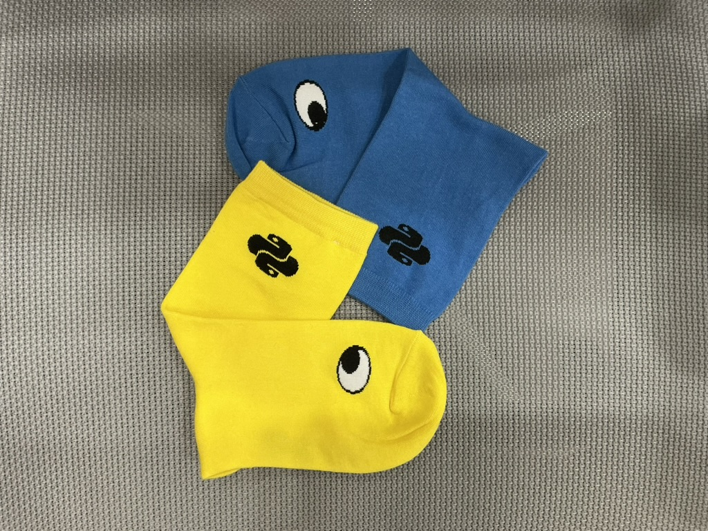

* this list will be replaced by the table of contents
{:toc}

# Pycon 2025 후기

이번에 그동안 참여해보고 싶었던 파이콘에 참여하게 되었습니다. 작년에는 수원에서 진행되어서 거리가 좀 있어 참여하지 못했는데, 이번에 집과 가까운 동국대에서 진행된다는 소식을 듣고 바로 참가 티켓을 구매하게 되었습니다. 이번 파이콘에서 인상깊었던 세션들에 대해 정리해보고 느낀 점을 짧게 끄젹여보겠습니다.

*파이콘에서 산 양말 굿즈*

파이콘 발표 세선과 발표자 정보는 아래 링크에서 확인 가능합니다.

[Pycon 발표 세선 정보](https://2025.pycon.kr/sessions/timetable)

---

## 1일차

### 선 넘지 않는 윤리적인 LLM 솔루션 구축

**이미지 출처: [Sprout Social](https://sproutsocial.com/insights/ai-ethics/)**

이 세션을 들으며, AI가 비즈니스와 사회에 미치는 영향이 점점 커지고 있다는 사실을 다시금 느꼈습니다. 단순히 모델의 성능과 정확도를 높이는 것만으로는 충분하지 않고, 보안·윤리·생산성 사이의 균형을 어떻게 맞출 것인가가 핵심이라는 점이 특히 인상 깊었습니다. 데이터 보호와 규제 준수 같은 보안 요구사항을 지키면서도 혁신과 생산성을 높이는 방법을 찾는 것이 앞으로 AI 산업의 중요한 과제가 될 것이라는 생각이 들었습니다.

또한 국내 AI 산업이 겪고 있는 기술적·조직적·규제적 과제에 대한 설명도 흥미로웠습니다. 특히 한국 문화와 언어 맥락을 충분히 반영하지 못하는 글로벌 모델의 한계, 그리고 AI와 보안 전문가 부족 문제는 앞으로 국내 AI산업이 해결해나가야 되는 문제라 생가이 들었습니다. 더불어 RLHF, PPO, DPO 같은 정렬(Alignment) 기술이 어떻게 모델을 사람의 의도와 윤리 기준에 맞추는지 구체적으로 알 수 있었습니다. 앞으로는 AI가 단순히 “똑똑한 답변”을 하는 것에서 나아가, “올바르고 안전한 답변”을 하는 모델로 발전하는 것이 무엇보다 중요하다는 생각을 하게 되었습니다.

### Python과 함께하는 AI 플랫폼

이번 발표는 급격히 늘어난 유저 수와 그에 따른 모델 파이프라인 폭증에 대응하기 위해 당근이 도입한 솔루션을 소개하는 세션이었습니다. 발표는 모델 훈련(Model Training)과 모델 추론(Model Inference) 두 파트로 나뉘어 진행되었는데, 각 단계에서의 체계적인 접근이 인상 깊었습니다.

모델 훈련 파트에서는 파이썬의 높은 자유도에서 오는 단점을 보완하기 위한 여러 시도가 돋보였습니다. Kubeflow와 TFX(TensorFlow Extended)를 활용해 파이프라인의 재사용성을 높였고, protobuf를 통해 학습 및 파이프라인 관련 파라미터를 명확히 정의하고 관리함으로써 데이터 타입의 모호성을 줄였습니다. 또한 uv 패키지 매니저와 pyproject.toml을 함께 사용해 더 빠르고 효율적인 학습 환경을 구성한 점도 인상적이었습니다.

모델 추론 파트에서는 대규모 트래픽에 대응하기 위한 추론 환경 최적화 전략이 소개되었습니다. Apache Beam과 Dataflow를 기반으로 한 아키텍처를 구축하고, 네트워크 I/O와 GPU 메모리 사용을 정교하게 최적화하여 전체적인 효율성과 안정성을 높인 사례가 흥미로웠습니다.

MLOps에 관심이 많은 저에게 이 세션은 이번 파이콘에서 가장 인상 깊었던 발표 중 하나였고, 추후 공개될 영상을 보며 다시 한 번 세부 내용을 차근차근 복기하고 싶다는 생각이 들었습니다.

## 2일차

### 파이썬으로 엮는 나만의 레거시 (박해선)

**이미지 출처: [gitfiti repository](https://github.com/gelstudios/gitfiti)**

이번 세션은 머신러닝 관련 책과 교재를 꾸준히 집필·번역해 오신 박해선 작가님의 발표였습니다. 저 역시 혼공머나 트랜스포머를 활용한 자연어 처리 같은 책을 통해 작가님의 작업을 많이 접해왔기 때문에, 이번에 직접 뵙고 발표를 들을 수 있어 인상 깊었습니다. 발표에서 작가님은 **개발 인생에서 나만의 레거시를 만들어라**라는 메시지를 강조하셨습니다. 특히 기억에 남았던 말은 **직장에서의 일이 내 안의 100% 동기부여를 끌어낼 가능성은 적다**는 부분이었습니다. 회사의 일이 흥미와 적성에 꼭 맞을 때도 있지만, 언제나 그렇다는 보장은 없기 때문에, 스스로 커리어를 오래 이어갈 수 있는 동기를 부여해 줄 '나만의 레거시'나 '히스토리'를 쌓는 것이 중요하다는 것이죠. 그런 레거시를 만드는 방법으로는 개발 커뮤니티 참여나 오픈소스 기여, 그리고 이런 파이콘 같은 컨퍼런스에서 발표하는 활동들을 제안하셨습니다.

저 역시 이번 파이콘에 참여하면서 다음 파이콘에서는 꼭 발표해 보고 싶다는 생각을 하게 됐는데, 이 세션을 들으면서 그 마음이 더욱 커졌습니다. 발표를 준비하며 나만의 레거시를 쌓는 과정 자체가 값진 경험일 뿐 아니라, 수업 준비 과정에서 교수자가 학생보다 더 많이 공부하는 것처럼, 발표 준비를 통해 제 자신도 더 많이 배우고 성장할 수 있을 것 같다는 확신이 들었습니다. 이 발표는 개인적으로 강한 동기부여를 얻은 뜻깊은 세션이었습니다.

### 개발이 즐거워진다: 생성형 AI와 컨테이너로 보다 집중하는 파이썬 개발

**이미지 출저: [kiro dev blog](https://kiro.dev/blog/introducing-kiro/)**

사실 이 발표는 AWS에서 개발한 개발 도구 'Kiro'의 홍보 성격이 강한 세션이었지만, 단순한 제품 소개를 넘어 앞으로의 개발 문화에 대한 여러 통찰을 얻을 수 있었던 유익한 시간이었습니다. 평소 저를 포함한 많은 개발자들은 ChatGPT나 Cursor 같은 AI 도구를 활용할 때 바로 프롬프트를 입력해 코드 작성이나 디버깅을 시작하곤 합니다. 문제 해결 속도가 빠르다는 장점은 있지만, 이 과정에서 팀의 코드 컨벤션을 무시하거나 불필요한 파일까지 수정되는 등 코드의 중요한 맥락을 놓치는 문제가 자주 발생합니다.

Kiro의 접근 방식은 이와 달리 신선했습니다. 새 프로젝트를 시작할 때 먼저 프로젝트의 스코프, 요구사항, 한계점, 기술 스택 등을 Tech Spec으로 정리하고 난 후 개발을 시작합니다. 이 모든 과정은 자동으로 마크다운 문서로 기록되며, 덕분에 보다 체계적이고 일관된 개발 환경을 유지할 수 있다는 점이 인상적이었습니다. Kiro 개발 과정을 보고, 앞으로의 개발 문화에서 문서화의 중요성이 더욱 커질 것이라는 점을 실감했습니다. AI 시대 이전에도 문서화는 개발자 간 원활한 커뮤니케이션을 위한 필수 도구였지만, 이제는 문서화가 잘 되어 있는 팀일수록 AI 도구를 더 효과적으로 활용할 수 있고, AI와 더 효율적으로 대화할 수 있겠다고 느꼈습니다. 또한, AI와 협업할 때는 요구사항을 정확히 설명하는 능력이 핵심 스킬로 자리 잡고 있음을 깨달았습니다. 단순히 개발자뿐 아니라 기획자와 디자이너까지도 명확한 문서화와 설명 능력을 갖추는 것이 앞으로의 협업 효율성을 높이는 핵심 요소가 될 것 같습니다.
