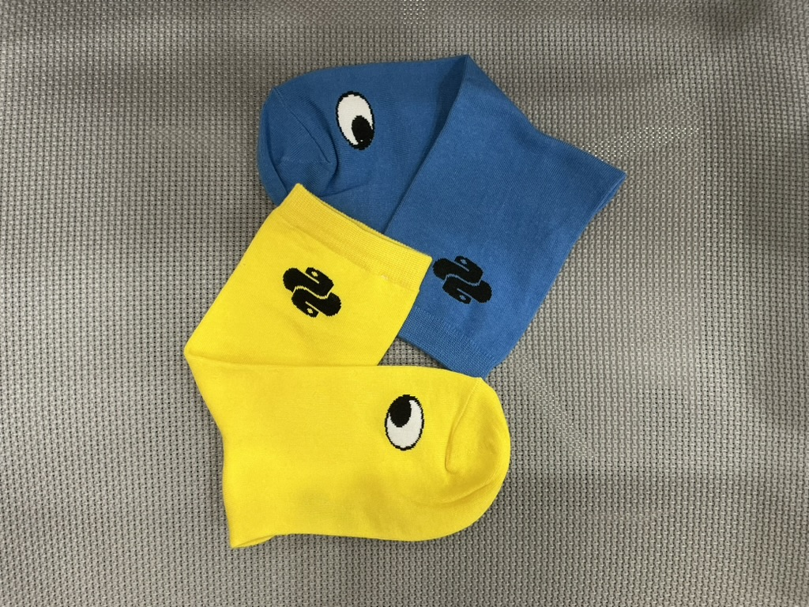

* This list will be replaced by the table of contents
{:toc}

# Recap of Pycon 2025

I had the opportunity to participate in Pycon, an event I had been eager to attend. Last year, due to its location in Suwon, I couldn't make it, but I was thrilled to hear that this year it would take place at Dongguk University, close to my home, prompting me to purchase my ticket immediately. In this post, I will summarize the sessions that left a lasting impression on me and share my reflections.

* Merchandise socks purchased at Pycon *

You can check the details of the Pycon presentations and presenters at the link below.

[Pycon Presentation Information](https://2025.pycon.kr/sessions/timetable)

---

## Day 1

### Building Ethical LLM Solutions without Crossing Boundaries

**Image source: [Sprout Social](https://sproutsocial.com/insights/ai-ethics/)**

Listening to this session, I was once again struck by the growing impact of AI on business and society. It became clear that simply improving a model's performance and accuracy is not enough; the key challenge lies in finding the balance between security, ethics, and productivity. I realized that discovering ways to enhance innovation and productivity while adhering to security requirements such as data protection and regulatory compliance will be crucial for the future of the AI industry.

I also found the discussions about the technical, organizational, and regulatory challenges facing the domestic AI industry to be intriguing. The limitations of global models in adequately reflecting Korean culture and language, as well as the shortage of AI and security professionals, are significant issues that the local AI industry must address moving forward. Moreover, I learned specifically how alignment technologies like RLHF, PPO, and DPO can align models with human intentions and ethical standards. I have come to see that it is vital for AI to evolve from merely providing "smart answers" to delivering "correct and safe answers."

### AI Platform with Python

This presentation introduced a solution implemented by Karrot to address the skyrocketing user count and the subsequent surge in model pipelines. The talk was divided into two parts: Model Training and Model Inference, with a systematic approach evident at each stage.

In the Model Training section, several attempts were made to compensate for the disadvantages arising from Python's high degree of flexibility. The use of Kubeflow and TFX (TensorFlow Extended) enhanced the reusability of pipelines, while protobuf was utilized to clearly define and manage learning and pipeline-related parameters, reducing data type ambiguity. Additionally, using the uv package manager alongside pyproject.toml to establish a faster and more efficient training environment was also impressive.

In the Model Inference section, optimization strategies for inference environments to cope with high traffic were introduced. The establishment of an architecture based on Apache Beam and Dataflow, along with refined optimization of network I/O and GPU memory usage, showcased an intriguing case that improved overall efficiency and stability.

As someone deeply interested in MLOps, this session was one of the most impressive presentations at this Pycon, and I eagerly look forward to watching the recorded video to review the details thoroughly.

## Day 2

### Creating Your Own Legacy with Python (Presented by Haesun Park)

**Image source: [gitfiti repository](https://github.com/gelstudios/gitfiti)**

This session featured a presentation by author Haesun Park, who has consistently written and translated books related to machine learning. As I have encountered the author's work through books like "Learning with Python" and "Natural Language Processing with Transformers," it was particularly moving to see and hear from them in person. The key message shared during the presentation was to **create your own legacy throughout your development career**. One notable statement was that **it is unlikely that work in the office will motivate you 100% from within**. While sometimes the work aligns perfectly with our interests and skills, there is no guarantee this will always be the case. Therefore, it is important to build your "personal legacy" or "history" that can serve as self-motivation to sustain your career over time. Suggested methods for building such a legacy included participating in development communities, contributing to open source, and presenting at conferences like Pycon.

Participating in this year's Pycon has sparked a strong desire in me to present at the next Pycon. After this session, I feel even more encouraged to prepare for a presentation, as I believe the process of building my legacy in this way will not only be a valuable experience but will also allow me to learn and grow significantly, much like how professors study more than students when preparing for classes. This presentation was a meaningful session that provided me with strong motivation.

### Development Becomes Enjoyable: Focusing Python Development with Generative AI and Containers

**Image source: [kiro dev blog](https://kiro.dev/blog/introducing-kiro/)**

While this presentation was primarily promotional for the development tool 'Kiro' developed by AWS, it offered valuable insights into the future of development culture beyond just introducing a product. Like many developers, including myself, I often dive straight into coding or debugging with AI tools like ChatGPT or Cursor by entering prompts. Although this rapid problem-solving approach has its advantages, it can often lead to ignoring team code conventions or making unnecessary changes, which can overlook critical contexts in the code.

Kiro's approach, however, was refreshingly different. When starting a new project, the development begins only after outlining the project's scope, requirements, limitations, and technology stack in what they call a Tech Spec. This entire process is automatically documented in Markdown, allowing for a more systematic and consistent development environment, which I found impressive. Observing the Kiro development process made me realize that the importance of documentation in future development culture will only continue to grow. Even before the AI era, documentation was essential for smooth communication among developers, but now teams with well-maintained documentation will be able to use AI tools more effectively and engage in more productive discussions with AI. I also realized that the ability to accurately describe requirements will become a key skill when collaborating with AI. Not only developers, but also planners and designers will need to acquire clear documentation and explanation skills to enhance future collaboration efficiency.