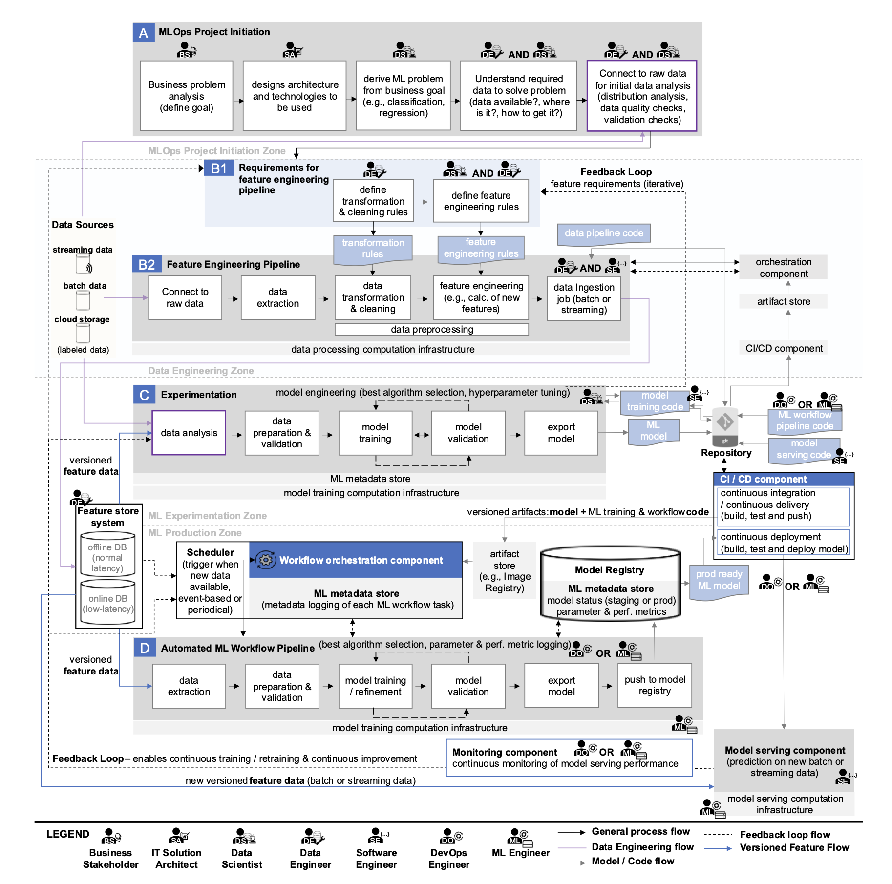

* this list will be replaced by the table of contents
{:toc}

## 🦾 많은 기업들이 쓰고 있는 k8s

"ML 엔지니어"나 "MLOps 엔지니어" 채용 공고를 보다 보면 꼭 빠지지 않고 등장하는 단어가 있죠. 

*출저: 토스, 크래프트테크놀로지스, 마키나락스 MLOps Enginner job descritption*

바로 **쿠버네티스(Kubernetes, k8s)** 입니다. 공부해보면 머리가 지끈거리는 것 같은 이 녀석, 도대체 왜 이렇게 많은 기업들이 머신러닝 모델을 훈련하고 배포하는 데 사용하고 있는 걸까요? 기업들이 왜 쿠버네티스를 도입하는지 그 이유를 파헤쳐 보겠습니다.

이번 포스팅에서는 MLOps에서 쿠버네티스가 왜 사용되는지 전반적인 이유에 대해 알아보겠습니다.

## 😵‍💫 툭 건드리면 무너질거 같아요

K8s를 쓰는 이유를 살펴보기 전, 아래 도표를 한번 살펴보죠. 

*출저: Machine Learning Operations (MLOps):
Overview, Definition, and Architecture*

MLOps에서 모델을 배포하기까지 필요한 단계들을 정리한 플로우차트입니다. 한 눈에 봐도 복잡하죠? 이 복잡한 과정에서 체계적으로 관리하고 모니터링하는 시스템 없이 개발 과정이 이루어진다면, 문제나 에러가 발생하는 건 시간문제이고, 개발 과졍에서 당연히 병목현상이 발생할 수 밖에 없습니다.  

MLOps에서 모델을 실제 서비스에 배포하기까지 거쳐야 하는 단계들을 정리해 놓은 플로우차트입니다. 참 복잡하죠? 이렇게 복잡한 과정을 제대로 관리하고 모니터링할 수 있는 체계적인 시스템 없이 진행한다면 어떨까요? 작은 문제나 에러가 눈덩이처럼 불어나 전체 개발 흐름을 멈춰 세우는 건 시간문제일 뿐이고, 당연히 여러 곳에서 병목현상이 발생해 팀의 속도가 크게 느려질 수밖에 없습니다. 그래서 결국 안정적이고 효율적인 MLOps 환경을 위해서는 이러한 복잡성을 관리해 줄 수 있는 도구와 시스템이 꼭 필요합니다.

## 🐳 K8s를 쓰는 이유

머신러닝과 딥러닝 워크로드는 자원 소모가 크고, 반복적인 실험과 안정적인 서비스 운영이 필수적입니다. 쿠버네티스(Kubernetes)는 이러한 요구를 충족하기 위해 확장성, 이식성, 재현성, 내결함성과 같은 핵심 기능을 제공하여 ML 모델 학습과 배포 환경을 효율적이고 안정적으로 관리할 수 있게 해줍니다.

### 1. **확장성(Scalabe)**
   - 쿠버네티스의 가장 중요한 장점 중 하나는 워크로드와 상황에 맞춰 자원을 자동으로 늘리거나 줄일 수 있다는 점입니다. 예를 들어, ML 모델 학습이나 추론 서비스에서 갑자기 트래픽이 늘어나면 파드 수를 자동으로 확장해 성능을 유지하고, 사용량이 줄면 불필요한 자원을 줄여 비용을 절감할 수 있습니다. 즉, 쿠버네티스는 변화하는 환경에 유연하게 대응해 안정성과 효율성을 동시에 확보할 수 있게 해줍니다.

### 2. **이식성(Portable)**
   - 쿠버네티스는 특정 클라우드에 묶이지 않고 어디서든 쓸 수 있는 게 가장 큰 장점입니다. 오픈소스라 누구나 자유롭게 사용할 수 있고, 표준화된 API 덕분에 AWS, GCP 같은 다른 클라우드에서도 같은 명령어와 방식으로 서비스를 운영할 수 있습니다. 게다가 컨테이너 기반이라 컨테이너를 지원하는 환경이라면 클라우드든 온프레미스든 cross-platform으로 옮겨쓸 수 있습니다 (대신 온프레미스면 신경 쓸 부분이 더 많아지겠죠).

### 3. **재현성(Reproducible)**
   - ML 실험과 모델 개발은 매우 반복적인 프로세스이며, 실험 결과를 정확하게 재현하는 것은 MLOps의 가장 기본적인 요구사항입니다. 쿠버네티스는 컨테이너를 통해 학습 코드, 라이브러리 버전, 운영체제 환경까지 모든 것을 불변(immutable)의 이미지로 고정시킵니다. 이를 통해 데이터셋, 코드, 환경 변수를 완벽하게 통제하며 실험을 반복할 수 있고, "내 컴퓨터에서는 됐는데..."와 같은 고질적인 문제를 근본적으로 해결할 수 있습니다.

### 4. **내결함성(Fault Tolerable)**
   - 장시간 소요되는 모델 학습 작업이나 24시간 운영되어야 하는 추론 서비스에서 하드웨어나 소프트웨어의 장애는 치명적일 수 있습니다. 쿠버네티스는 자가 치유(self-healing) 기능을 내장하고 있어, 특정 노드나 파드에 장애가 발생하면 자동으로 해당 워크로드를 건강한 다른 노드로 재스케줄링하고 서비스를 복구합니다. 이러한 강력한 내결함성은 ML 파이프라인의 안정성을 보장하며, 수동 개입 없이도 시스템이 지속적으로 운영될 수 있도록 합니다.

## ✅ 정리

이번 글에서는 쿠버네티스가 MLOps 환경에서 왜 중요한지, 그리고 확장성(Scalability), 이식성(Portability), 재현성(Reproducibility), 내결함성(Fault Tolerance) 같은 핵심 장점들을 중심으로 살펴보았습니다. 요약하자면, 쿠버네티스는 복잡한 ML 워크로드를 안정적이고 유연하게 운영할 수 있도록 돕는 강력한 기반이라고 할 수 있습니다. 다음 포스팅에서는 한 걸음 더 나아가, 쿠버네티스가 실제 모델 훈련과 배포 과정에서 어떤 방식으로 활용되는지를 구체적인 사례와 함께 심층적으로 알아보겠습니다.

### 참조링크
- [토스 MLOps Engineer](https://toss.im/career/job-detail?job_id=6072871003)
- [크래프트테크놀로지스 MLOps Engineer](https://www.wanted.co.kr/wd/297084)
- [마키나락스 MLOps Engineer](https://www.wanted.co.kr/wd/302165)
- [삼성SDS: 오픈소스를 활용한 쿠버네티스(Kubernetes) 기반 MLOps 플랫폼 도입](https://www.samsungsds.com/kr/techreport/kubernetes-mlops.html)
- [Machine Learning Operations (MLOps):
Overview, Definition, and Architecture](https://arxiv.org/pdf/2205.02302)