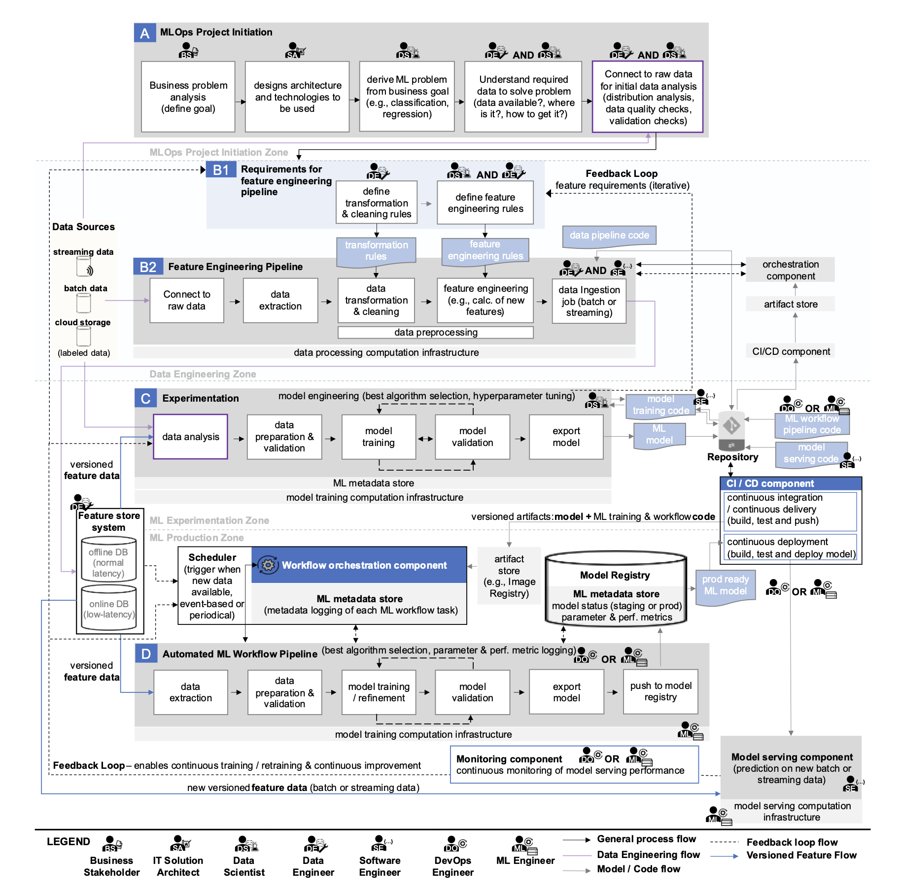

* this list will be replaced by the table of contents
{:toc}

## 🦾 K8s: Widely Adopted by Many Companies

If you browse job postings for "ML Engineers" or "MLOps Engineers," there's one term that consistently appears across the board.

*Source: Toss, CraftTechnologies, MakinaRocks MLOps Engineer job descriptions*

That's right - **Kubernetes (k8s)**! This seemingly complex technology that can make your head spin when you first dive into it. But why are so many companies using it for training and deploying machine learning models? Let's dig deep into the reasons behind widespread Kubernetes adoption in the enterprise world.

In this post, we'll explore the fundamental reasons why Kubernetes has become indispensable in MLOps environments.

## 😵‍💫 It Feels Like Everything Could Collapse at Any Moment

Before diving into why we use K8s, let's take a look at this diagram:

*Source: Machine Learning Operations (MLOps):
Overview, Definition, and Architecture*

This flowchart illustrates all the stages involved in deploying ML models to production services in MLOps. Pretty complex, right? What would happen if we tried to manage and monitor such an intricate process without a systematic framework? Small issues or errors would snowball into major problems that could halt the entire development workflow. Naturally, bottlenecks would emerge across multiple points, significantly slowing down team velocity. This is exactly why a stable and efficient MLOps environment absolutely requires robust tools and systems capable of managing this complexity.

## 🐳 Why We Use K8s

Machine learning and deep learning workloads are resource-intensive and require repetitive experimentation alongside stable service operations. Kubernetes addresses these demands by providing core capabilities like scalability, portability, reproducibility, and fault tolerance, enabling efficient and reliable management of ML model training and deployment environments.

### 1. **Scalability**
   - One of Kubernetes' most crucial advantages is its ability to automatically scale resources up or down based on workload demands and conditions. For example, when ML model training or inference services experience sudden traffic spikes, Kubernetes can automatically scale the number of pods to maintain performance. When usage decreases, it reduces unnecessary resources to cut costs. In essence, Kubernetes enables flexible response to changing environments while ensuring both stability and efficiency.

### 2. **Portability**
   - Kubernetes' greatest strength lies in its cloud-agnostic nature - you can use it anywhere without being locked into a specific cloud provider. Being open source, it's freely accessible to everyone, and thanks to standardized APIs, you can operate services using the same commands and methods across different clouds like AWS, GCP, and others. Moreover, since it's container-based, you can migrate across platforms - whether cloud or on-premises - as long as the environment supports containers (though on-premises deployment does require more attention to detail).

### 3. **Reproducibility**
   - ML experimentation and model development are highly iterative processes, and accurately reproducing experimental results is a fundamental requirement in MLOps. Kubernetes uses containers to freeze everything - training code, library versions, and operating system environments - into immutable images. This allows perfect control over datasets, code, and environment variables for repeatable experiments, fundamentally solving the age-old problem of "it worked on my machine..."

### 4. **Fault Tolerance**
   - Hardware or software failures can be catastrophic for long-running model training jobs or inference services that need to operate 24/7. Kubernetes comes with built-in self-healing capabilities - when failures occur in specific nodes or pods, it automatically reschedules those workloads to healthy nodes and recovers services. This robust fault tolerance ensures ML pipeline stability and enables continuous system operation without manual intervention.

## ✅ Summary

In this article, we've explored why Kubernetes is crucial in MLOps environments, focusing on its core advantages: Scalability, Portability, Reproducibility, and Fault Tolerance. In summary, Kubernetes serves as a powerful foundation that enables stable and flexible operation of complex ML workloads. In our next post, we'll take this a step further and dive deep into how Kubernetes is practically utilized in actual model training and deployment processes, complete with concrete examples and use cases.

### References
- [Toss MLOps Engineer](https://toss.im/career/job-detail?job_id=6072871003)
- [CraftTechnologies MLOps Engineer](https://www.wanted.co.kr/wd/297084)
- [MakinaRocks MLOps Engineer](https://www.wanted.co.kr/wd/302165)
- [Samsung SDS: Introducing Kubernetes-based MLOps Platform Using Open Source](https://www.samsungsds.com/kr/techreport/kubernetes-mlops.html)
- [Machine Learning Operations (MLOps):
Overview, Definition, and Architecture](https://arxiv.org/pdf/2205.02302)