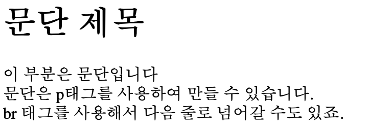
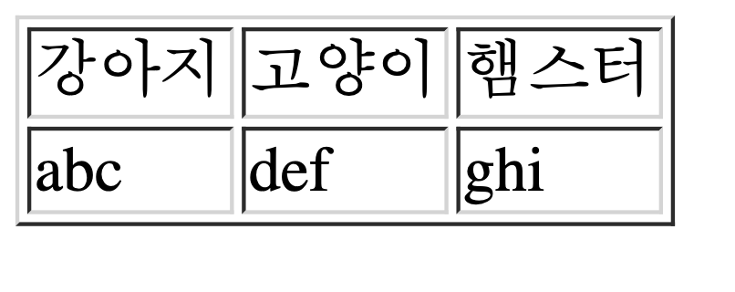

# HTML (HyperText Markup Language)
- 웹페이지의 구조를 구성해주는 코드
- 대부분 tag로 구성되어 있음
  - [w3schools](https://www.w3schools.com/tags/ref_byfunc.asp) 웹사이트를 보면 html에 다양한 태그가 사용되는걸 확인할 수 있음

- **예시**

```html
<!DOCTYPE html>
<html lang="en">
<head>
    <meta charset="UTF-8">
    <title>Document</title>
</head>
<body>
    <h1>Hello</h1>
    <h2>goodbye</h2>
</body>
</html>
```

{:.centered width="600" loading="lazy"}

## 단락 구분 태그
- `<p>`: 문단 블록 설정 태그
- `<h1>`, `<h2>`, ... ,`<h6>`: 단락 제목 구분  
- `<br/>`: 줄바꿈 태그

- 예시

```html
<!DOCTYPE html>
<html lang="en">
<head>
    <meta charset="UTF-8">
    <title>Document</title>
</head>
<body>
    <h1>문단 제목</h1>
    <p>
        이 부분은 문단입니다<br/>
        문단은 p태그를 사용하여 만들 수 있습니다.<br/>
        br 태그를 사용해서 다음 줄로 넘어갈 수도 있죠.
    </p>
</body>
</html>
```

{:.centered width="600" loading="lazy"}

## 링크 태그
- `<a href="path">abc</a>`: 다른 html 페이지로 연결되는 링크를 만드는 태그. href속성에 연결될 html 경로를 넣어준다

## 이미지 태그
- ``: 이미지를 넣어주는 태그

## 테이블 태그
- 테이블 태그 `<table></table>`내에 행을 생성하는 태그 `<tr>`과 열을 생성하는 태그`<td>`로 테이블을 만들 수 있다.
- 예시

```html
<table>
    <tr>
        <td>강아지</td>
        <td>고양이</td>
        <td>햄스터</td>
    </tr>
    <tr>
        <td>abc</td>
        <td>def</td>
        <td>ghi</td>
    </tr>
</table>
```

{:.centered width="600" loading="lazy"}

