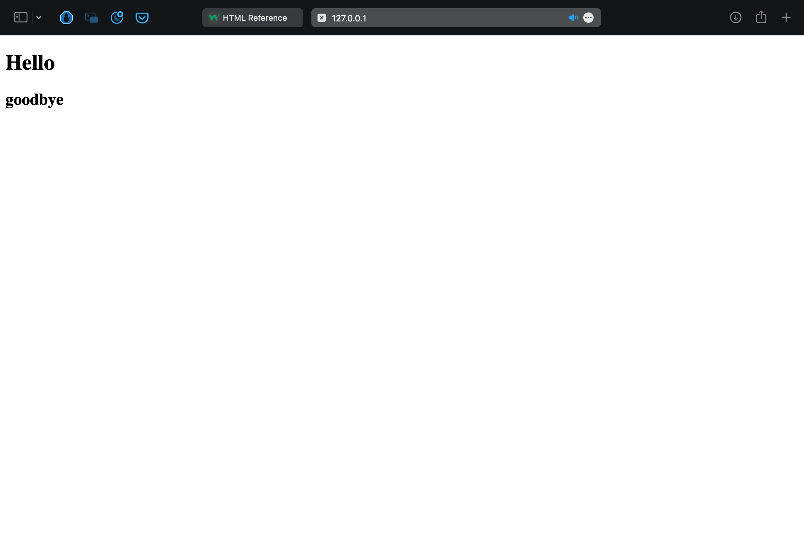

# HTML (HyperText Markup Language)
- 웹페이지의 구조를 구성해주는 코드
- 대부분 tag로 구성되어 있음
  - [w3schools](https://www.w3schools.com/tags/ref_byfunc.asp) 웹사이트를 보면 html에 다양한 태그가 사용되는걸 확인할 수 있음
예시
```html
<!DOCTYPE html>
<html lang="en">
<head>
    <meta charset="UTF-8">
    <title>Document</title>
</head>
<body>
    <h1>Hello</h1>
    <h2>goodbye</h2>
</body>
</html>
```
