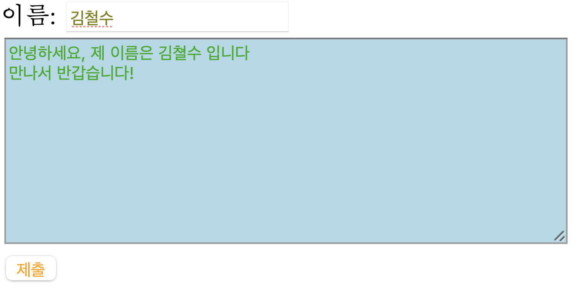

# 웹페이지 꾸미기

- HTML만 사용하면 웹페이지를 만들 때 필요한 요소들 (테이블, 이미지, 문단 등)을 웹페이지에 삽입하고 배치할 수 있지만, HTML만 사용하면 웹페이지의 뼈대밖에 만들지 못한다. HTML에 CSS를 입히면, 웹페이지에 색깔을 넣고 폰트 사이즈를 바꾸는 등 더 다양하게 꾸밀 수 있다.

## HTML 태그 내에서 CSS 사용 (Inline CSS)

- CSS 문법을 HTML 태그 내에 `style=` attribute를 사용하여 직접 문단(`<p>`), div 블록 (`<div>`)등을 꾸밀 수 있다.
- **예시:**

```html
<!DOCTYPE html>
<html lang="en">
<head>
    <meta charset="UTF-8">
    <title>Document</title>
</head>
<body>
    <div style="width:100px;height:100px;background-color:lightgreen;position:absolute;top: 300px;left: 300px;">
        div 블록
        abcd
    </div>
</body>
</html>
```


- style 내의 요소들과 의미를 살펴보면 다음과 같다.
  - `width`: `<div>`의 너비
  - `height`: `<div>`의 높이
  - `background-color`: `<div>`의 바탕 색깔
  - `position`: `<div>`의 위치 기준 (absolute는 브라우저 창의 맨 왼쪽 위가 기준점이 된다는 의미)
  - `top`: `<div>`가 아래로 얼마나 내려올지
  - `left`: `<div>`가 오른쪽으로 얼마나 갈지

## `<style>` 태그 내에서 CSS 사용하기 (Internal CSS)

- CSS관련 문법을 HTML내에서 `<style>`태그로 묶어서 사용할 수도 있다.
  
- **예시:**

```html
<!DOCTYPE html>
<html lang="en">
<head>
    <meta charset="UTF-8">
    <title>Document</title>
    <style>
        input[type=text]{
            color: olive;
        }
        textarea[name=paragraph]{
            background-color: lightblue;
            color: #12ab12;
        }
        input[type=button]{
            color: orange;
        }
    </style>
</head>

<body>

    <form>
        이름: <input type="text" name="" id=""><br>
        <textarea name="paragraph" cols="50" rows="10"></textarea><br>
        <input type="button" value="제출">


    </form>
</body>
</html>
```



- style 태그내에 문법을 살펴보면, 

```html
input[type=text]{
    color: olive;
}
```

- 먼저 바꾸고 싶은 태그를 설정하고 (input) 그 태그 중 원하는 특정 태그의 attribute(i.e. type, name)를 지정한다.
- 지정한 태그르 설정 후, 바꾸고 싶은 요소들(i.e. background-color, color)을 원하는 값으로 설정해준다.

## CSS 파일을 따로 만든 후 HTML로 불러오기 (External CSS)

- 


