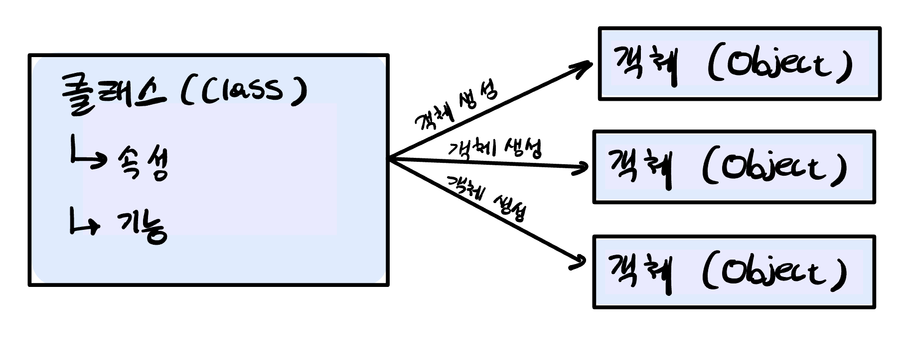

* 
{:toc}

## 객체지향 프로그래밍 (Object Oriented Programming: OOP) 기본
- 객체지향 프로그래밍에서 **객체 (Object)**는 속성(Attribute)과 기능(Function)으로 구성됩니다.
- 객체 생성은 클래스를 만든 뒤 객체는 클래스를 호출하면서 여러 개를 만들 수 있다.  
  


- 객채를 사용해서 코드를 구성하면 코드를 재사용하고 모듈화하게에 용이합니다.

## 클래스와 객체 생성
### 클래스 생성
- 클래스는 다음과 같이 선언할 수 있습니다.

```python
class Car: # (1)
    def __init__(self, color, length): # (2)
        self.color = color
        self.length = length
    
    def doStop(self): # (3)
        print('Stop!')
    
    def doStart(self):
        print('Start!')

    def printCarInfo(self):
        print(f'self.color: {self.color}')
        print(f'self.length: {self.length}')
```

(1) 먼저 class 예약어와 클래스 이름으로 클래스를 선언합니다 <br>
(2) 클래스 내에 `__init__`함수에 클래스 속성들을 선언합니다.<br>
(3) `__init__`함수 아래 필요한  <br>

- 기능 내에 `self` 변수는는 선언한 기능이 클래스 안에 포함된 기능이라는 것을 표현합니다.

### 객체 생성
- 객체는 다음과 같은 생성자로 만들 수 있습니다.
```python
hyundai = Car('red', 300)
benz = Car('black', 200)
```

- `hyundai`와 `benz`는 같은 클래스를 활용하여 생성되었지만, 각자 다른 속성들을 지닌 독립적인 객체입니다.
```python
hyundai.printCarinfo()
benz.printCarinfo()
```
```
>>> self.color: red
>>> self.length: 300
>>> self.color: black
>>> self.length: 200
```

## 객체 속성 변경
- 생성된 객체의 속성을 변경하려면, 다음과 같이 속성을 불러내고 변환하고 싶은 값으로 넣어주면 변경이 가능합니다.
```python
hyundai.color = 'Purple'
hyundai.printCarInfo()
```
```
>>> self.color: Purple
>>> self.length: 300
```

## 객체와 메모리
### 얕은 복사와 깊은 복사
- 변수와 객체를 사용해서 생성자를 통해 객체를 생성하면, 객체는 메모리에 저장이 되고, 변수는 그 객체를 참조하는 참조값이 됩니다. 
```python
hyundai = Car('green', 400)
```

- 객체를 얕은 복사로 복사하면, 객체가 저장되어 있는 메모리 주소값만 복사가 되고, 객체 자체가 따로 재생성되지 않습니다.
```python
kia = hyundai
print(id(kia) == id(hyundai))
# id는 객체의 메모리 주소값을 보여줍니다.
```
```
True
```

- 객체를 깊은 복사로 복사하면, 똑같은 객체가 다른 메모리 주소로 새로 생성되면서 새 변수로 복사가 됩니다.
```python
import copy
kia = copy.copy(hyundai)
print(id(kia) == id(hyundai))
# id는 객체의 메모리 주소값을 보여줍니다.
```
```
False
```

## 클래스 상속
- 클래스는 다른 클래스를 상속하여 상속한 클래스 내에 있는 기능들을 같이 사용할 수 있습니다.
- 클래스 상속은 부모 클래스를 괄호에 넣어주며 상속할 수 있습니다.
```python
class NewCar(Car):
    ...
```
- `NewCar`는 이제 `Car`에 있는 기능들을 사용할 수 있게 되는 것입니다.


