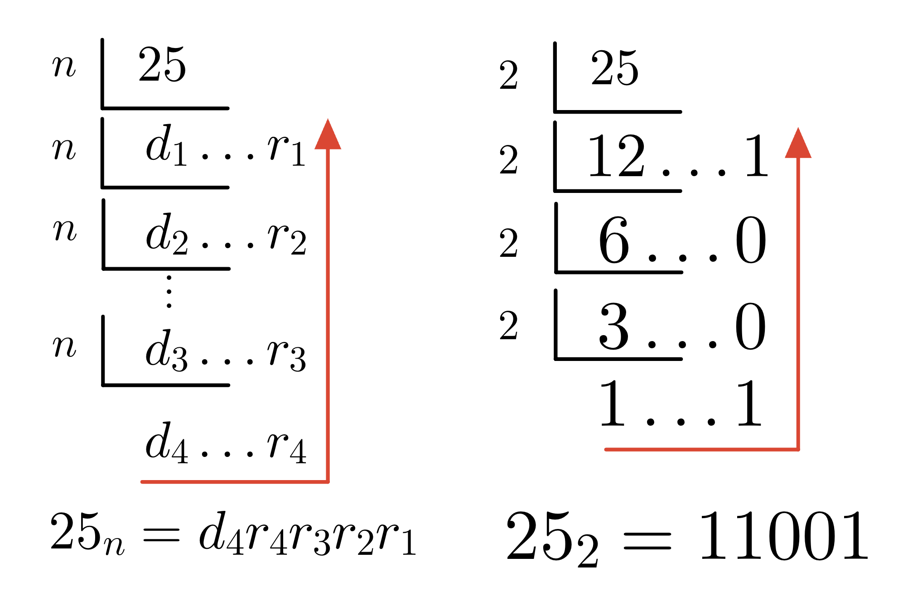
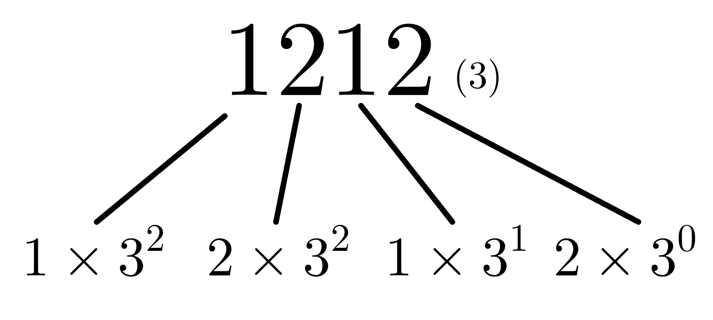

* 
{:toc}

## 약수와 소수
- 약수: 특정 수를 나머지 없이 나누어 떨어지게 하는 수
  - 2는 4의 약수 (4÷2=2), 4는 104의 약수 (104÷4=26)
- 소수는 1과 지산민을 약수로 가지는 수 (0과 1은 제외)

## 최대공약수 (GCD:Greatest Common Denominator)/ 최소공배수 (LCM: Least Common Multiplier)

### 공약수
- 두 개 이상의 수에서 공통된 약수
  - 12의 약수 -> [**1**, **2**, 3, **4**, 6, 12]
  - 20의 약수 -> [**1**, **2**, **4**, 5, 10, 20]
  - 12와 20의 공약수는 **[1, 2, 4]** 입니다

### 최대공약수
- 두 개 이상의 수의 공약수의 최댓값
  - 12와 20의 최대공약수는 **4**입니다.

#### 소인수분해를 활용한 최대공약수 구하는 법
- 비교하는 수들의 소인수의 공통인 소인수 거듭제곱에서 지수가 작은 수를 모두 곱합니다.
  - 36과 60
    - 36 $$ \rightarrow 2^2 \times 3^2$$

    - 60 $$ \rightarrow 2^2 \times 3 \times 5$$
    - 최대공약수 $$ \rightarrow 2^2 \times 3 =12$$

#### 나눗셈을 활용한 최대공약수 구하는 법
- 비교하는 수들을 동시에 나눌 수 있는 소수로 나누며 더 이상 나눌 수 없을 때까지 나누면 최대공약수를 구할 수 있습니다.

#### 유클리드 호제법 (Euclidian algorithm)

### 최소공배수
- **공배수**: 두 개 이상의 수에서 공통된 배수
- **최소공배수**: 공배수 중 가장 작은 수

  - 3의 배수 : $$3, 6, 9, 12, \textbf{15}, 18, ...27, \textbf{30} ...$$ 

  - 5의 배수 : $$5, 10, \textbf{15}, 20, 25, \textbf{30}, ...40, 45 ...$$ 
  - 3과 5의 공배수는 **15, 30 ...** 입니다.
#### 소인수분해로 최소공배수 구하는 법

{:.centered width="500" loading="lazy"}

### 두 수의 최대공약수와 최소공배수의 연관성
- 두 수의 최대공약수와 최소공배수의 곱은 비교하는 두 수의 곱과 같습니다. ([출저](https://www.brainkart.com/article/Relationship-between-LCM-and-GCD_39335/))

- $$n_1$$ 과 $$n_2$$ 라는 두 수가 있다면, 

$$
n1 \times n2 = LCM(n1, n2) \times GCD(n1, n2)
$$

- 위 식의 관계로, 어떤 수들의 최소공약수나 최소공배수 중 하나만 알아도 나머지 값을 계산할 수 있습니다.

$$
LCM(n1, n2) = \frac{n1 \times n2}{GCD(n1, n2)}, \; GCD(n1, n2) = \frac{n1 \times n2}{LCM(n1, n2)}
$$


## 진법
- 진법이란?
  - 정해진 숫자만을 사용하여 수를 표현하는 방법
- n-진법
  - $$0 \sim (n-1)$$사이의 숫자만을 활용해 모든 수를 표기합니다
    - ex1) 2진법 $$\rightarrow [0, 1]$$ 
    - ex2) 8진법 $$\rightarrow [0, 1, 2, 3, 4, 5, 6, 7]$$ 
    - ex2) 16진법 $$\rightarrow [0, 1, 2, 3, 4, 5, 6, 7, 8, 9, A, B, C, D, E, F]$$ 

### 10진수를 n-진수로 변환

{:.centered width="500" loading="lazy"}

### n-진수를 10진수로 변환

{:.centered width="500" loading="lazy"}

### 2진수를 8진수로 변환
- 2진수로 되있는 수를 
### 2진수를 16진수로 변환

## 진수 변환 파이썬 함수
### 10진수를 n진수로
- 10진수를 2, 8, 16진수로 변환할 때 각각 `bin()`, `oct()`, `hex()`함수를 사용하여 변환할 수 있습니다.
```python
print(f'38을 2진수로: {bin(38)}')
print(f'38을 8진수로: {oct(38)}')
print(f'38을 16진수로: {hex(38)}')
```
```
38을 2진수로: 0b100110
38을 8진수로: 0o46
38을 16진수로: 0x26
```
- 위 함수들은 항상 문자열을 반환합니다.

### n진수를 10진수로
- 파이썬 함수 `int`로 다른 진수의 수를 10진수로 변환할 수 있습니다.
```python
print(f'2진수 0b100110 -> 10진수 {int('0b100110', 2)})
```
```
2진수 0b100110 -> 10진수 38
```

## 수열
- 규칙성을 가지고 나열되어 있는 수들
