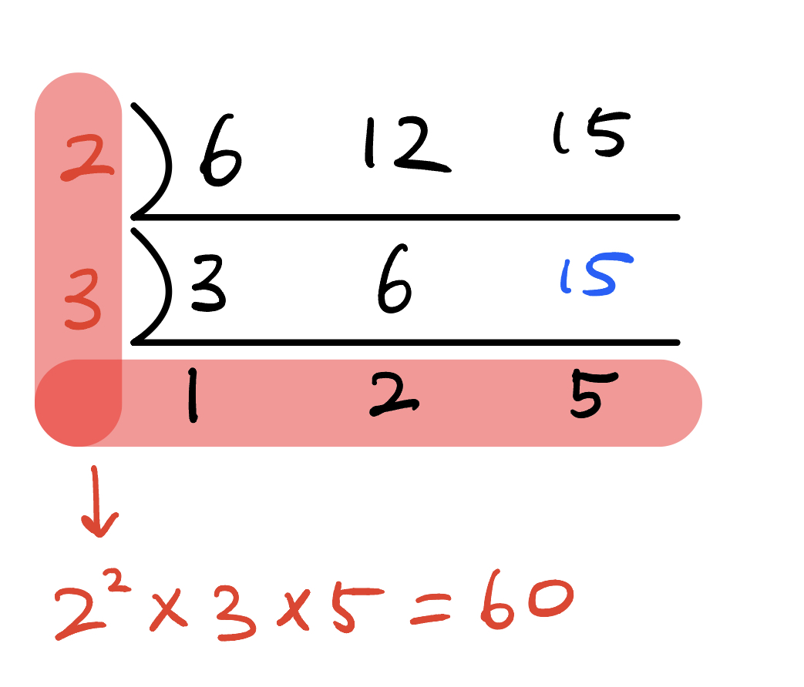

* 
{:toc}

## 약수와 소수
- 약수: 특정 수를 나머지 없이 나누어 떨어지게 하는 수
  - 2는 4의 약수 (4÷2=2), 4는 104의 약수 (104÷4=26)
- 소수는 1과 지산민을 약수로 가지는 수 (0과 1은 제외)

## 최대공약수 (GCD:Greatest Common Denominator)/ 최소공배수 (LCM: Least Common Multiplier)

### 공약수
- 두 개 이상의 수에서 공통된 약수
  - 12의 약수 -> [**1**, **2**, 3, **4**, 6, 12]
  - 20의 약수 -> [**1**, **2**, **4**, 5, 10, 20]
  - 12와 20의 공약수는 **[1, 2, 4]** 입니다

### 최대공약수
- 두 개 이상의 수의 공약수의 최댓값
  - 12와 20의 최대공약수는 **4**입니다.

#### 소인수분해를 활용한 최대공약수 구하는 법
- 비교하는 수들의 소인수의 공통인 소인수 거듭제곱에서 지수가 작은 수를 모두 곱합니다.
  - 36과 60
    - 36 $$ \rightarrow 2^2 \times 3^2$$

    - 60 $$ \rightarrow 2^2 \times 3 \times 5$$
    - 최대공약수 $$ \rightarrow 2^2 \times 3 =12$$

#### 나눗셈을 활용한 최대공약수 구하는 법
- 비교하는 수들을 동시에 나눌 수 있는 소수로 나누며 더 이상 나눌 수 없을 때까지 나누면 최대공약수를 구할 수 있습니다.

#### 유클리드 호제법 (Euclidian algorithm)
- 두 자연수 $$n_1$$, $$n_2$$ ($$n_1 > n_2$$) 에 대햐여 $$n_1$$을 $$n_2$$로 나눈 나머지를 $$r$$이라 할 떄, $$n_1$$, $$n_2$$의 최대공약수는 $$n_2$$와 $$r$$의 최대공약수와 같습니다

### 최소공배수
- **공배수**: 두 개 이상의 수에서 공통된 배수
- **최소공배수**: 공배수 중 가장 작은 수

  - 3의 배수 : $$3, 6, 9, 12, \textbf{15}, 18, ...27, \textbf{30} ...$$ 

  - 5의 배수 : $$5, 10, \textbf{15}, 20, 25, \textbf{30}, ...40, 45 ...$$ 
  - 3과 5의 공배수는 **15, 30 ...** 입니다.
#### 소인수분해로 최소공배수 구하는 법

{:.centered width="500" loading="lazy"}

### 두 수의 최대공약수와 최소공배수의 연관성
- 두 수의 최대공약수와 최소공배수의 곱은 비교하는 두 수의 곱과 같습니다. ([출저](https://www.brainkart.com/article/Relationship-between-LCM-and-GCD_39335/))

- $$n_1$$ 과 $$n_2$$ 라는 두 수가 있다면, 

$$
n1 \times n2 = LCM(n1, n2) \times GCD(n1, n2)
$$

- 위 식의 관계로, 어떤 수들의 최소공약수나 최소공배수 중 하나만 알아도 나머지 값을 계산할 수 있습니다.

$$
LCM(n1, n2) = \frac{n1 \times n2}{GCD(n1, n2)}, \; GCD(n1, n2) = \frac{n1 \times n2}{LCM(n1, n2)}
$$

---

## 진법
- 진법이란?
  - 정해진 숫자만을 사용하여 수를 표현하는 방법
- n-진법
  - $$0 \sim (n-1)$$사이의 숫자만을 활용해 모든 수를 표기합니다
    - ex1) 2진법 $$\rightarrow [0, 1]$$ 
    - ex2) 8진법 $$\rightarrow [0, 1, 2, 3, 4, 5, 6, 7]$$ 
    - ex2) 16진법 $$\rightarrow [0, 1, 2, 3, 4, 5, 6, 7, 8, 9, A, B, C, D, E, F]$$ 

### 10진수를 n-진수로 변환

{:.centered width="500" loading="lazy"}

### n-진수를 10진수로 변환

{:.centered width="500" loading="lazy"}

### 2진수를 8진수로 변환
- 2진수로 되있는 수를 
### 2진수를 16진수로 변환

## 진수 변환 파이썬 함수
### 10진수를 n진수로
- 10진수를 2, 8, 16진수로 변환할 때 각각 `bin()`, `oct()`, `hex()`함수를 사용하여 변환할 수 있습니다.
```python
print(f'38을 2진수로: {bin(38)}')
print(f'38을 8진수로: {oct(38)}')
print(f'38을 16진수로: {hex(38)}')
```
```
38을 2진수로: 0b100110
38을 8진수로: 0o46
38을 16진수로: 0x26
```
- 위 함수들은 항상 문자열을 반환합니다.

### n진수를 10진수로
- 파이썬 함수 `int`로 다른 진수의 수를 10진수로 변환할 수 있습니다.
```python
print(f'2진수 0b100110 -> 10진수 {int('0b100110', 2)})
```
```
2진수 0b100110 -> 10진수 38
```
---

## 수열
- 규칙성을 가지고 나열되어 있는 수들

$$
2 \; 4 \; 6 \; 8... x
$$

- 위 수열은 다음과 같은 규칙성을 가진 **일반항**으로 나타낼 수 있습니다

$$
a_n = 2n
$$

### 항들의 합과 항의 관계
- 수열 합은 다음과 같이 나타낼 수 있다

$$
s_n = a_1 + a_2 + a_3 + ... + a_n
$$

- 특정항은 특정항까지의 합에서 특정항 전까지의 합을 뺀 값과 같습니다.

$$
a_n = s_n - s_{n-1}
$$

- 단 $$n >= 2$$이고, $$a_1=s_1$$입니다

### 등차수열
- 등차 수열은 연속된 두 항의 차이가 일정한 수열입니다.
- 두 항의 차이를 **공차**라고 부릅니다.

$$
2 \; 4 \; 6 \; 8... x
$$

- 위 수열은 공차가 2인 등차수열입니다.

#### 등차수열의 일반항
- 등차수열의 일반항은 다음과 같이 나타낼 수 있습니다

$$
a_n = a_1 + d(n-1)
$$

- $$d=$$ 공차
- $$n=$$ 등차수열 자리 ($$1, 2, 3 ...$$)

#### 등차수열의 합

$$
s_n = \frac{n(a_1+a_n)}{2}
$$

### 등비수열
- 연속된 두 항의 비율이 일정한 수열을 의미합니다.
- 두 항의 비율을 **공비**라고 부릅니다.

$$
2 \; 6 \; 18 \; 54 \; 162... x
$$

- 위 등비수열의 공비 $$r$$은 3임을 알 수 있습니다.

#### 등비수열의 일반항

$$
a_n = a_1 \times r^{n-1}
$$

#### 등비중항
- 연속된 세 항의 가운데 항을 구하는 공식은 다음과 같습니다.

$$
a_n = \sqrt{a_{n-1} \times a_{n+1}}
$$

#### 등비수열의 합

$$
s_n = a_1\frac{1-r^n}{1-r}
$$

### 시그마: 수열의 합
- 수열의 합 $$s_n$$은 다음과 같은 형식으로 나타낼 수 있습니다.
  - ex) 등비수열의 합

  $$
  s_n = \sum_{k=1}^{n} a_1r^{k-1}
  $$

  - 1부터 n까지의 등비수열의 합을 일반항을 통해 구할 수 있습니다.

### 계차 수열
- 계차수열은 특정 수열의 인접하는 두 항의 차로 이루어져 있는 수열입니다.
- 예를 들어, 다음과 같은 수열 $$\{a_n\}$$가 있다면, 

$$
\{a_n\}=\{0 , 3 , 8 , 15 , 24 , 35 , 48 , 63\}
$$

- 인접하는 항들의 차로 이루어진 수열 $${b}$$는 다음과 같습니다.

$$
\{b_n\} = \{3 , 5 , 7 , 9 , 11 , 13 , 15\}
$$

- 이뗴 $$\{b_n\}$$ 수열을 $$\{a_n\}$$수열의 **계차수열**이라 합니다.

## 계차수열을 이용하여 일반항 찾기

$$
\begin{aligned}
\sum_{k=1}^{n-1} b_k = a_n - a_1 \\
a_n = a_1 + \sum_{k=1}^{n-1} b_k 
\end{aligned}
$$

- 위 공식에서 계차수열의 일반항($$b_k$$)을 활용하여 계차수열의 합의 공식을 활용하면, 수열 $$\{a_n\}$$의 일반항을 구할 수 있습니다.

<!-- - 예시: 다음과 같은 수열과 그에 상응하는 계차수열을 예시로 들어보겠습니다.

$$
\{a_n\}=\{0 , 3 , 8 , 15 , 24 , 35 , 48 , 63\}
$$

$$
\{b_n\} = \{3 , 5 , 7 , 9 , 11 , 13 , 15\}
$$

- $$\{b_n\}$$을 살펴보면, 등차가 2이이고 3부터 시작하는 등차수열임을 알 수 있습니다. 등차수열의 일반항은 다음과 같습니다.([참조](#등차수열의-일반항))

$$
b_n = b_1 + d(n-1)
$$

- 등차수열의 합은 다음과 같습니다. ([참조](#등차수열의-합))

$$
\sum_{k=1}^{n-1} b_k = \frac{n(b_1+b_n)}{2}
$$

- 등차수열 합의 공식에 등차수열 일반항 공식을 대입하면 다음과 같이 나옵니다.

$$
\sum_{k=1}^{n-1} b_k = \frac{n(b_1 + b_1 + d((n-1)-1))}{2}
$$ -->

### 피보나치 수열
- 피보나치 수열은 다음과 같이 나타낼 수 있습니다

$$
a_n = a_{n-1}+a_{n-2}
$$

이떄, $$a_1=1,\; a_2=1$$ 입니다. $$a_3$$부터 위 공식이 적용됩니다.

$$a_{fib} = \{1, 1, 2, 3, 5, 8, 13, ...\}$$

## 팩토리얼
- 1부터 양의 정수 n까지의 정수를 모두 곱한 값입니다.

$$ \begin{align}
&0! = 1\\
&1! = 1\\
&2! = 1\times 2 = 2\\
&3! = 1\times 2 \times 3 = 6\\
&4! = 1\times 2 \times 3 \times 4 = 24\\
&...
\end{align}$$

## 순열
- 순서 상관있이 n게의 선택지 중 r개를 선택하는 경우의 수
$$
_{n} P_{r} = \frac{n!}{(n-r)!}
$$

## 조합
- 순서 상관없이 n게의 선택지 중 r개를 선택하는 경우의 수

$$
_{n} C_{r} = \frac{_{n} P_{r}}{r!} = \frac{n!}{r!(n-r)!}
$$
