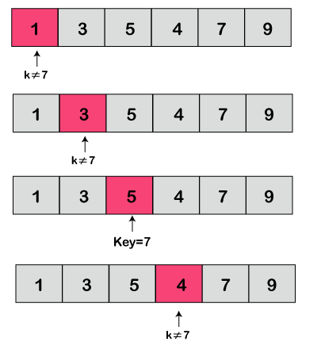
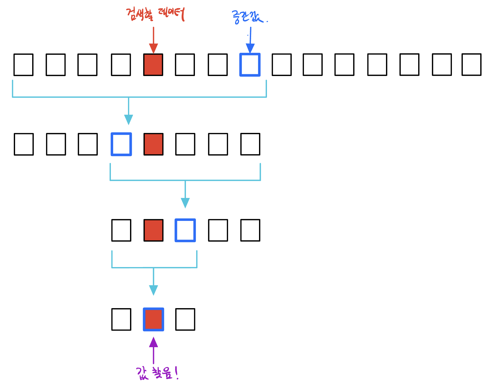
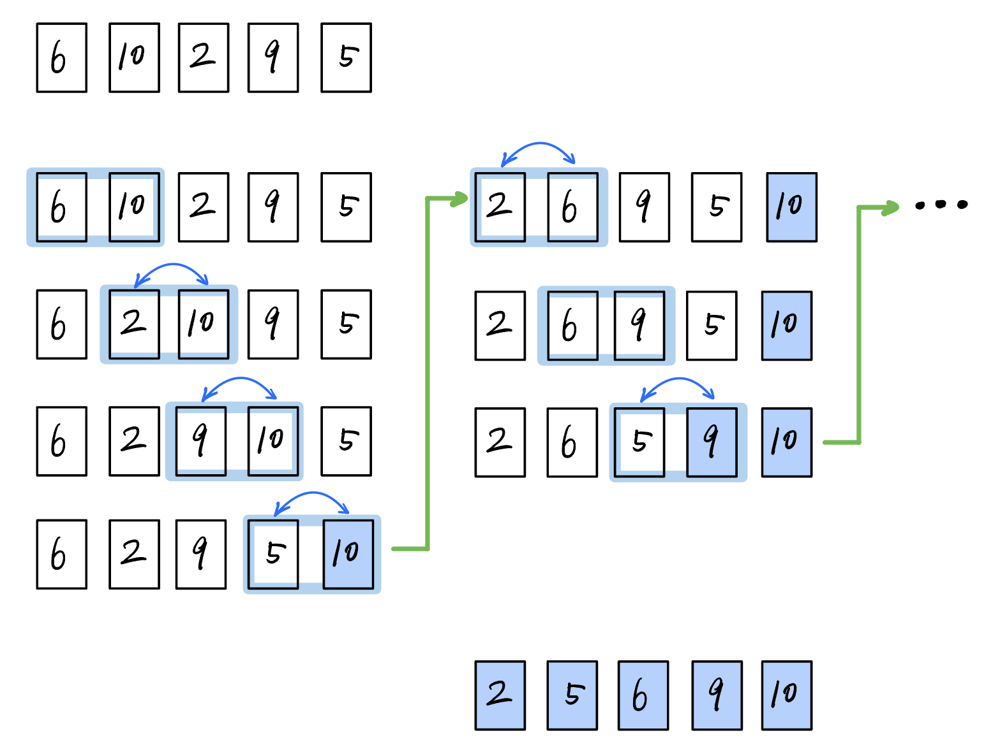
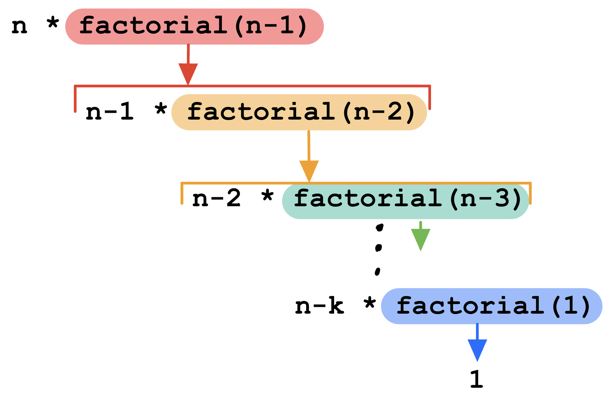

* 
{:toc}

## 검색 알고리즘 (Search Algorithm)

### 선형 검색 (Linear Search)
- 원소들이 담겨있는 리스트가 주어졌을 떄, $$x$$라는 값을 찾고 싶으면 리스트에 있는 원소들을 처음부터 하나하나 비교해가며 값의 위치를 찾는 알고리즘 입니다. 

{:.centered loading="lazy"}

출저: [Java T Point](https://www.javatpoint.com/linear-search-in-python)
{:.figcaption}

### 이진 검색 (Binary Search)
- 리스트에 이진 검색을 실행하기 위해서는, 값을 찾을 리스트가 정렬이 되어 있어야 합니다. 
  - 리스트가 정렬이 되어 있지 않다면, 정렬 알고리즘을 사용하여 먼저 정렬해 줍니다.
- 아래 예시는 이진 검색 알고리즘을 시각화한 그림입니다. 

{:.centered loading="lazy"}

- 이진 검색 알고리즘의 과정은 다음과 같습니다.
  - 먼저, 리스트에서 검색할 범위를 초기화 해줍니다.(처음 검색은 0번째 인덱스 (`start_idx = 0`)부터 마지막 인덱스(`end_idx = len(lst)`)까지)
  - 검색 범위의 중간 인덱스를 구합니다 (`mid = (start_idx+end_idx)//2`)
  - 값을 찾을 떄 까지 다음 조건절이 포함된 반복문을 돌립니다.
    - 중간 인덱에 있는 값이 찾고자 하는 값보다 작으면, 마지막 인덱스(`end_idx`)를 중간 인덱스로 바꾸고, 변경된 범위에서 다시 새로운 중간 인덱스 값을 구합니다.
    - 중간 인덱스에 있는 값이 찾고자 하는 값보다 크면, 시작 인덱스(`start_idx`)를 중간 인덱스로 바꾸고, 변경된 범위에서 다시 새로운 중간 인덱스 값을 구합니다.
    - 중간 인덱스에 있는 값이 찾고자 하는 값과 같다면, 값을 찾았으니 반복문을 exit합니다.


## 정렬 알고리즘 (Sorting Algorithm)

### 버블 정렬 (Bubble Sort)
- 버블 정렬은 비눗방울이 물 속에서 올라는 모습처럼 각 인덱스를 지나면서 다음 요소와 비교하며 값의 위치를 바꿔주는 정렬 방법입니다. 



### 삽입 정렬 (Insertion Sort)

### 

## 재귀 함수 (Recursion)
- 재귀 함수는 함수 내에 자기 자신을 부르는 함수입니다. 
- 예를 들어 다음과 같이 팩토리얼을 구하는 함수를 살펴보면, 
```python
def factorial(n):
    if n == 1:
        return n
    return n * factorial(n-1)
```

{:.centered load="lazy"}

