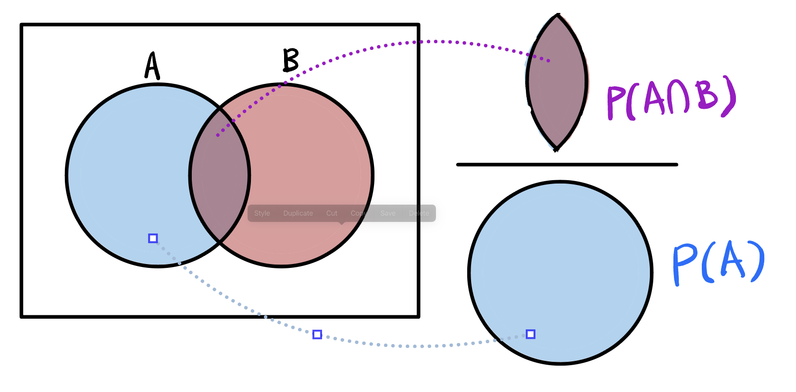

* tableofcontents
{:toc}

## 확률
- 확률은 모든 경우에서 특정 사건이 발생하는 비율을 의미합니다. 
### 표본공간 (Sample Space)
- 표본공간은 어떤 상황에서 발생할 수 있는 모든 결과들의 집합을 뜻합니다. 
	- 예를 들어 동전 던지기의 표본 공간은 $$S=\{\text{앞면, 뒷면}\}$$이 되고, 주사위 던지기의 경우, 표본 공간은 $$S=\{1, 2, 3, 4, 5, 6\}$$이 됩니다.
- 표본 공간이 주어졌고, 표본 공간 내에 모든 원소들이 일어날 확률이 동일하다면, 사건 A가 일어날 확률은 다음과 같이 표현할 수 있습니다.

$$
P(A)=\frac{\text{사건 $A$가 일어날 원소의 수}}{\text{표본공간 $S$의 원소의 수} }
$$

### 통계적 확률

$$
\lim_{n\rightarrow\infty}\frac{r}{N}
$$

### 확률의 성질
#### 합사건(Union) $$A\cup B$$
- 합사건은 사건 A 또는 사건 B가 일어나는 경우의 집합입니다.

#### 곱사건(Intersection) $$A\cap B$$
- 곱사건은 사건 A와 사건 B가 동시에 일어나는 경우의 집합입니다.

#### 배반사건(Mutually Exclusive Event) $$A\cap B=\emptyset$$
- 배반사건은 사건 A와 사건 B가 동시에 일어날 수 없는 경우를 설명합니다.

#### 여사건(Complement) $$A^c$$
- 여사건은 표본집합에서 사건 A가 일어나지 않는 경우의 사건의 집합입니다.

#### 확률의 법칙
1) 확률의 덧셈법칙

$$
P(A\cup B) = P(A)+P(B)-P(A\cap B)
$$

2) A와 B의 배반사건

$$
P(A\cap B) = P(\emptyset) = 0
$$

3) 여사건

$$
P(A)+P(A^c)=1
$$

### 조건부 확률 (Conditional Probability)

$$
\begin{equation}
\begin{cases}
P(B|A) = \frac{P(A \cap B)}{P(A)},\; P(A)\neq 0 \\
P(A|B) = \frac{P(A \cap B)}{P(B)},\; P(B)\neq 0
\end{cases}
\end{equation}
$$

{:.centered width="500"}

#### 확률의 곱셈법칙
- 위 조건부 확률공식를 재정렬하면 두 집합의 교집합을 구할 수 있는 공식을 구할 수 있습니다.

$$P(A\cap B) = P(A)\cdot P(B|A) = P(B)\cdot P(A|B)$$

- 사건 A, B가 독립일 경우, 

$$P(A\cap B) = P(A)\cdot P(B)$$

### 베이즈 정리 (Bayes' Theorem)
- 조건부 확률의 확장 개념으로, 

$$P(B_i|A) = \frac{P(B_i\cap A)}{P(A)} = \frac{P(B_i){(A|B_i)}}{\sum_{j=1}^k P(B_j)P(A|B_j)}$$

## 확률변수 (Random Variable)
- 확률변수는 표본 공간에서 각 사건에 실수를 대응시키는 함수입니다. 예를 들어 주사위를 던졌을 떄 1이 나오는 사건에 1을, 2가 나오는 사건에 2를 붙일 떄 확률변수는 1부터 6이 됩니다.
- 확률변수의 값들을 하나의 사건에 하나의 값만 붙입니다. 
- 보통 사건들의 확률 변수를 나타낼 때는 대문자로 표현하고, 확률변수의 특정 값을 소문자로 표현합니다.
  - 예시: 주사위를 던지는 사건들의 확률변수 $$X={1, 2, 3, 4, 5, 6}$$ | 6을 던지는 사건의 확률변수 $$X=x = 6$$
- 확률변수에는 두 가지 종류가 있습니다.
  - 이산 확률 변수 (Discrete Random Variable): 위 주사위 예시와 같이 셀 수 있는 값들로 구성되어 있는 값을이 모여있는 확률변수를 의미합니다.
  - 연속 확률 변수 (Continuous Random Variable): 실수나 무한대와 같이 연속적이거나 구분되어 있지 않은 값들이 모여있는 확률변수를 의미합니다.

### 확률변수의 평균과 분산

#### 확률변수의 평균(기대값)
- 확률변수의 평균은 기대값이라고도 부르며, 다음과 같이 계산됩니다.

$$E(X) = \sum_{i=1}^n x_iP(x_i) = x_1P(x_1)+x_2P(x_2)+ ... x_nP(x_n)$$

- $$a$$, $$b$$가 상수일 때 기대값은 다음과 같은 성질을 가지고 있습니다.
  - $$E(a) = a$$: 상수의 기대값을 상수 그 자체입니다.
  - $$E(aX) = aE(X)$$ . 
  - $$E(aX+b) = aE(X) + b$$ . 
  - $$E(aX\pm bY) = aE(X)\pm bE(Y)$$ . 
  - $$E(X, Y) = E(X)E(Y)\; \text{if X, Y mutually exclusive} $$ (X, Y가 독립일 때) . 

#### 확률 변수의 분산
- 확률변수의 분산은 다음과 같이 나타냅니다 

$$Var(X) = \frac{1}{N}\sum(x_i-\mu)^2$$

- $$a$$, $$b$$가 상수일 때 분산은 다음과 같은 성질을 가지고 있습니다.
  - $$Var(a) = 0$$: 상수의 분산은 0입니다.
  - $$Var(aX) = a^2E(X)$$ . 
  - $$Var(X+Y) = Var(X) + Var(Y) + 2Cov(X, Y)$$ . 
  - $$Var(aX\pm bY) = a^2Var(X)\pm b^2Var(Y) + 2Cov(X, Y)$$ . 
  - $$Var(XY) = 0\; \text{if X, Y mutually exclusive} $$ (X, Y가 독립일 때) . 
  - $$Var(X) = E(X^2) = [E(X)]^2$$.

### 공분산(Covariance)
- 두 확률변수의 선형관계를 나타내는 값입니다.
- 한 확률변수의 값이 상승할 때...
  - 다른 확률변수도 상승한다면 양의 공분산을 $$Cov(X, Y) > 0$$ 
  - 다른 확률변수이 하락한다면 음의 공분산을 $$Cov(X, Y) < 0$$ 가지게 됩니다.

$$Cov(X, Y) = E[(X-E(X)(Y-E(Y))] = \frac{\sum_i^n(X_i-\bar{X})(Y_i-\bar{Y})}{n-1}$$

출저: [Career Foundry](https://careerfoundry.com/en/blog/data-analytics/covariance-vs-correlation/)
{:figcaption}