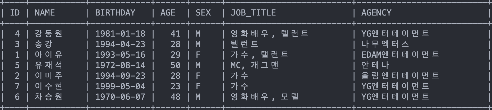
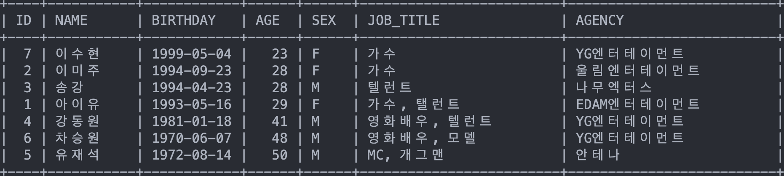
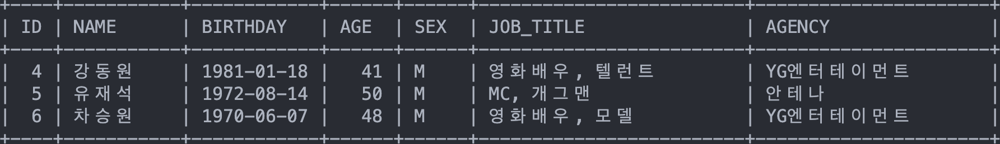
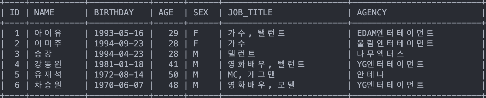
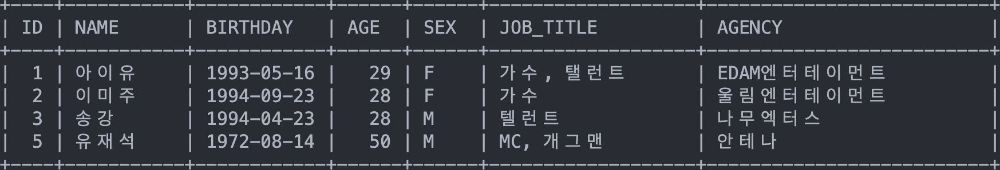
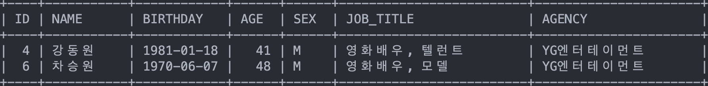
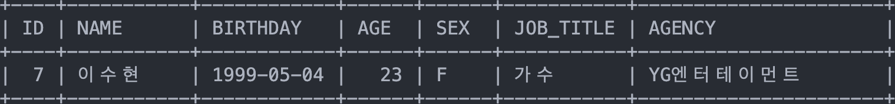
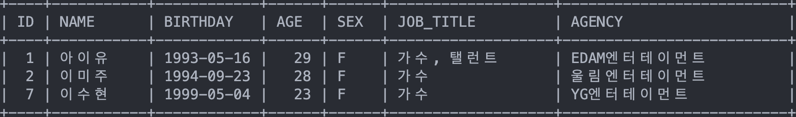
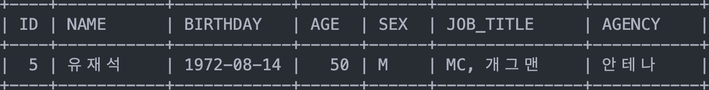

* toc
{:toc}

# 데이터 정렬

- SQL에서 데이터 정렬은 `ORDER BY`를 활용하여 테이블 내의 데이터를 정렬할 수 있습니다.
- `ORDER BY`는 `SELECT`문과 함께 쓰여 데이터를 정렬합니다.
```sql
SELECT col1, col2, ...
FROM tablename
ORDER BY col1, ASC/DESC, col2 ASC/DESC ...;
```
- ORDER BY는 지정된 컬럼들을 기준으로 오름차순(ASC) 또는 내림차순(DESC)으로 데이터를 정렬합니다
  - 컬럼들은 작성하는대로 우선순위가 됩니다
  - 기본값으로 오름차순으로 정렬됩니다.
- `ORDER BY` 사용법을 시연하기 위해 `celeb`이라는 아래 테이블을 활용하겠습니다.


- 만약, celeb 테이블을 이름 순으로 정렬하고 싶다면, 다음과 같이 할 수 있습니다.
```sql
SELECT * FROM celeb ORDER BY name;
```
{:.centered width="1000"}
- 컬럼 이름을 여러 개 작성하여 복수 조건으로 테이블을 정렬할 수도 있습니다.
- 다음은 celeb 테이블을 나이(오름차순)와 이름(내림차순)으로 정렬하는 SQL문입니다.
```sql
SELECT *
FROM celeb
ORDER BY age, name DESC;
```	
{:.centered width="1000"}

# 비교연산자

- SQL문 `WHERE`에 비교연산자 조건을 붙여 원하는 조건의 데이터를 불러올 수도 있습니다.
- SQL에서 사용할 수 있는 비교연산자는 다음과 같습니다.

|연산자|의미|
|:--:|:--|
|column = A|컬럼 값이 A와 같다|
|column > A|컬럼 값이 A보다 크다 (초과)|
|column < A|컬럼 값이 A보다 작다 (미만)|
|column >= A|컬럼 값이 A보다 크거나 같다 (이상)|
|column <= A|컬럼 값이 A보다 작거나 같다 (이하)|
|column <> A|컬럼 값이 A보다 크거나 작다 (같지 않다)|
|column != A|컬럼 값이 A와 같지 않다|
{:.stretch-table}

- 위의 celeb 테이블을 활용하여 비교연산자는 다음과 같이 활용할 수 있습니다.
  - 나이가 30살보다 많은 연예인 데이터
  ```sql
  SELECT * FROM celeb WHERE age > 30;
  ```
  {:.centered width="1000"}
  - 생일이 1996년 이전인 연예인 데이터
  ```sql
  SELECT * FROM celeb WHERE birthday < 19960101;
  ```
  {:.centered width="1000"}
  - 기획사가 YG엔터테이먼트가 아닌 연예인 데이터
  ```sql
  SELECT * FROM celeb WHERE agency != 'YG엔터테이먼트';
  ```
  {:.centered width="1000"}

# 논리 연산자

- 논리연산자는 

|연산자|의미|
|:--|:--|
|A `AND` B|A와 B 모두 충족할 때 TRUE|
|A `OR` B|A 또는 B를 충족할 때 TRUE|
|`NOT` A|A를 만족하지 않을 때 TRUE|
|`BETWEEN` A `AND` B|값이 A와 B사이에 있을 때 TRUE|
|`IN` (val1, val2, ...)|값이 (val1, val2, ...)중 있을 때 TRUE|
|`LIKE` pattern|pattern에 값이 충족하면 TRUE|
{:.stretch-table}

## `AND` / `OR` / `NOT`

- AND와 OR, NOT 그리고 비교연산자들 조합하여, 원하는 조건의 데이터들을 필터링 할 수 있습니다.
- 아래는 celeb 테이블로 든 논리연산자 예시들 입니다
  - **성별이 남자이고, 소속사가 YG엔터테이먼트인 데이터를 이름 순으로 정렬**
  ```sql
  SELECT * 
  FROM celeb 
  WHERE sex='M' AND agency='YG엔터테이먼트' 
  ORDER BY name;
  ```
  {:.centered width="1000"}
  - **성별이 여자이거나 나이가 28살 이하인 YG엔터테이먼트 소속 연예인**
  ```sql
  SELECT * 
  FROM celeb 
  WHERE (sex='F' OR age<=28) AND agency='YG엔터테이먼트' 
  ORDER BY name;
  ```
  {:.centered width="1000"}
    - 여기서 주의해야 할 점은, `AND`가 `OR`보다 우선순위를 가진다는 점입니다. 만약, 위와 같이 괄호를 쓰지 않고 SQL문을 쓰게 된다면,
    ```sql
    SELECT * 
    FROM celeb 
    WHERE sex='F' OR age<=28 AND agency='YG엔터테이먼트' 
    ORDER BY name;
    ```
  {:.centered width="1000"}
    - `AND`가 먼저 처리되기 때문에, 위와 같이 *성별이 여자이거나, 나이가 28세 이하이고 YG소속인 연예인*인 데이터가 추출되어 버립니다.
  - **소속사가 YG가 아니고 나이가 30살 이상인 연예인**
  ```sql
  SELECT * 
  FROM celeb 
  WHERE NOT agency='YG엔터테이먼트' AND age>=30
  ORDER BY name;
  ``` 
  {:.centered width="1000"}

## `BETWEEN`

## `IN`

## `LIKE`
- `LIKE`는 데이터를 형식에 맞게 필터링을 해주는 명령어입니다. 
- int나 float처럼 비교연산자로 필터링 할 수 없는 아래 데모 데이터와 같은 varchar 데이터를 필터링할 때 유용합니다.


출저: [W3Schools](https://www.w3schools.com/sql/sql_like.asp)
{:.figcaption}

- 뮻ㅇ 러먊냥랮ㄷ