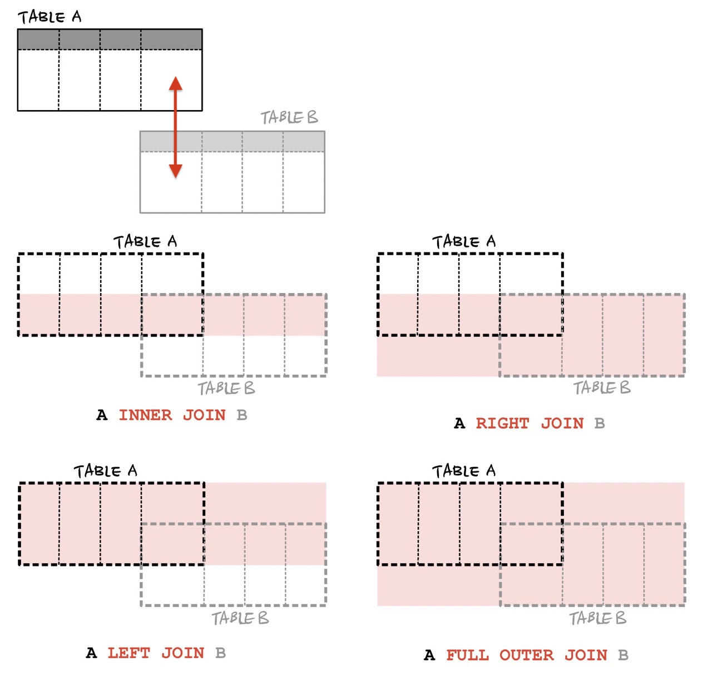

* toc
{:toc}

# UNION/UNION ALL

- `UNION/UNION ALL`문은 여러 쿼리문 있는 정보를 한 테이블로 묶어주는 역할을 합니다. 
- 그 중 UNION은 중복된 값들을 제거하여 테이블을 합치고, `UNION ALL`은 각 테이블의 중복값들을 모두 포함하여 테이블을 합칩니다. 
```sql
SELECT col1, col2 ... FROM table1
UNION | UNION ALL
SELECT col1, col2 ... FROM table2;
```
- 주의점
  - 전자의 컬럼 수와 후자의 컬럼 수가 동일해야 union문이 에러 없이 실행됩니다.
- 컬럼 수가 같지만, 다른 컬럼 그룹을 같이 합쳐도 에러 없이 작동은 하지만, 생성된 테이블의 컬럼 이름은 전자 쿼리의 컬럼 이름으로 지정됩니다.
- 예시:
  - 다음과 같은 테이블로 예시를 들어보겠습니다.
    - tableA
    
    |id|name|sex|location|
    |--|--|--|--|
    |1|Mike|M|Seoul|
    |2|Jake|M|Daegu|
    |3|Mary|F|Busan|
    |4|Jane|F|Seoul|
  - 성별이 여자인 사람을 검색하는 쿼리와 이름이 'J'로 시작하는 사람을 검색하는 쿼리를 UNION으로 실행하면 다음과 같은 결과가 나옵니다.
  ```sql
  SELECT id, name, sex FROM tableA WHERE sex='F'
  UNION
  SELECT id, name, sex FROM tableA WHERE name LIKE 'J%';
  ```

    |id|name|sex|
    |--|--|--|
    |3|Mary|F|
    |4|Jane|F|
    |2|Jake|M|
  - 같은 쿼리문들을 UNION ALL로 합치면 다음 결과가 나옵니다.
  ```sql
  SELECT id, name, sex FROM tableA WHERE sex='F'
  UNION
  SELECT id, name, sex FROM tableA WHERE name LIKE 'J%';
  ```

    |id|name|sex|
    |--|--|--|
    |3|Mary|F|
    |4|Jane|F|
    |2|Jake|M|
    |4|Jane|F|
    
  - UNION에서는 반복되는 값 (4, Jane, F, Seoul)이 한번만 나오지만, UNION ALL에서는 반복되는 값도 생략없이 그대로 합쳐치는 것을 확인할 수 있습니다.
  - 각 쿼리마다 서로 다른 컬럼조합들을 합쳐도 에러 없이 실행되지만, 컬럼명은 첫 쿼리문의 컬럼 이름으로 설정된 것을 확인할 수 있습니다.
  ```sql
  SELECT id, name, sex FROM tableA WHERE sex='F'
  UNION
  SELECT id, location, name FROM tableA WHERE name LIKE 'J%';
  ```

    |id|name|sex|
    |--|--|--|--|
    |3|Mary|F|
    |4|Jane|F|
    |2|Daegu|Jake|
    |4|Jane|Jane|

# JOIN

- `JOIN`은 SQL문에서 두 개 이상의 테이블을 결합해주는 명령어입니다.
- 테이블을 결합할 때는 결합할 기준 컬럼을 설정해줘야 합니다.
- 테이블을 합치는 방법에는 아래와 같이 크게 네가지 방법이 있습니다.
{:.centered width="700"}
- JOIN 문법은 아래와 같이 사용할 수 있습니다. `JOIN TYPE`에 원하는 결합 종류를 넣고, `ON`에 결합 기준이 될 각 테이블의 컬럼을 설정하면 됩니다. 
```sql
SELECT col1, col2, ... 
FROM tableA [JOIN TYPE] tableB
ON tableA.column = tableB.column
WHERE condition;
```
## INNER JOIN

- INNER JOIN은 두 테이블에서 공통된 요소들먼 결합해주는 방식입니다. 두 테이블의 교집합을 찾는 역할을 합니다.
- 예시를 위해 UNION 에서 사용된 tableA와 아래 테이블 tableB를 활용해보겠습니다.

  - tableA
  
    |id|name|sex|location|
    |--|--|--|--|
    |1|Mike|M|Seoul|
    |2|Jake|M|Daegu|
    |3|Mary|F|Busan|
    |4|Jane|F|Seoul|

  - tableB

    | name  | school   |
    |--|--|
    | Mike  | School A |
    | Mary  | School B |
    | John  | School C |
    | Harry | School D |

```sql
SELECT * 
FROM tableA INNER JOIN tableB
ON tableA.name = tableB.name;
```

| id   | name | sex  | location | name | school   |
|--|--|--|--|--|--|
|    1 | Mike | M    | Seoul    | Mike | School A |
|    3 | Mary | F    | Busan    | Mary | School B |

- INNER JOIN을 활용한 뒤, 두 테이블 사이 겹치는 이름 (Mike, Mary)의 데이터만 합쳐진 것을 확인할 수 있습니다.

## LEFT JOIN/RIGTH JOIN

- LEFT JOIN/RIGHT JOIN은 두 테이블의 교집합 영역과 왼쪽 또는 오른쪽의 테이블의 정보들을 합치는 결합 방식입니다.
- 테이블을 결합할 때, 왼쪽/오른쪽 테이블에 존재하지 않는 데이터들은 NULL값으로 채워집니다.
- **LEFT JOIN**
  ```sql
  SELECT * 
  FROM tableA LEFT JOIN tableB
  ON tableA.name = tableB.name;
  ```

  | id   | name | sex  | location | name | school   |
  |--|--|--|--|--|--|
  |    1 | Mike | M    | Seoul    | Mike | School A |
  |    2 | Jake | M    | Daegu    | NULL | NULL     |
  |    3 | Mary | F    | Busan    | Mary | School B |
  |    4 | Jane | F    | Seoul    | NULL | NULL     |

- **RIGHT JOIN**
  ```sql
  SELECT * 
  FROM tableA RIGHT JOIN tableB
  ON tableA.name = tableB.name;
  ```

  | id   | name | sex  | location | name  | school   |
  |--|--|--|--|--|
  |    1 | Mike | M    | Seoul    | Mike  | School A |
  |    3 | Mary | F    | Busan    | Mary  | School B |
  | NULL | NULL | NULL | NULL     | John  | School C |
  | NULL | NULL | NULL | NULL     | Harry | School D |


## FULL OUTER JOIN
- MySQL에서는 FULL OUTER JOIN을 제공하지 않지만, LEFT JOIN결과와 RIGHT JOIN 결과를 합쳐서 (UNION) 간접적으로 결과를 낼 수 있습니다.
```sql
SELECT * 
FROM tableA LEFT JOIN tableB
ON tableA.name = tableB.name
UNION
SELECT * 
FROM tableA RIGHT JOIN tableB
ON tableA.name = tableB.name
```

  | id   | name | sex  | location | name  | school   |
  |--|--|--|--|--|
  |    1 | Mike | M    | Seoul    | Mike  | School A |
  |    2 | Jake | M    | Daegu    | NULL  | NULL     |
  |    3 | Mary | F    | Busan    | Mary  | School B |
  |    4 | Jane | F    | Seoul    | NULL  | NULL     |
  | NULL | NULL | NULL | NULL     | John  | School C |
  | NULL | NULL | NULL | NULL     | Harry | School D |

## 컬럼 선택
- JOIN된 테이블에서 선택적으로 컬럼을 가져오고 싶다면, SELECT문에서 `tablename.columnname`형식으로 지정하면, 각 테이블의 컬럼 정보를 가져올 수 있습니다.
```sql
SELECT tableA.id, tableA.name, tableB.name, tableB.school 
FROM tableA LEFT JOIN tableB
ON tableA.name = tableB.name
UNION
SELECT tableA.id, tableA.name, tableB.name, tableB.school 
FROM tableA RIGHT JOIN tableB
ON tableA.name = tableB.name
```

  | id   | name | name  | school   |
  |--|--|--|--|
  |    1 | Mike | Mike  | School A |
  |    2 | Jake | NULL  | NULL     |
  |    3 | Mary | Mary  | School B |
  |    4 | Jane | NULL  | NULL     |
  | NULL | NULL | John  | School C |
  | NULL | NULL | Harry | School D |

## SELF JOIN
- SELF JOIN은 MySQL에서 INNER JOIN과 같이 쓰이는 문법으로, 다음과 같이 쓰입니다.
```sql
SELECT col1, col2, ...
FROM tableA, tableB, ...
WHERE tableA.colA = tableB.colB ...conditions;
```
  - 예시
  ```sql
  SELECT tableA.id, tableA.name, tableB.name, tableB.school 
  FROM tableA, tableB
  WHERE tableA.name=tableB.name;
  ```
    
    | id   | name | name | school   |
    |--|--|--|--|
    |    1 | Mike | Mike | School A |
    |    3 | Mary | Mary | School B |
    
- 컬럼을 묶는 WHERE절 뒤에 추가적인 조건들을 줄 수도 있습니다.
  - 예시
  ```sql
  SELECT tableA.id, tableA.name, tableB.name, tableB.school 
  FROM tableA, tableB
  WHERE tableA.name=tableB.name AND tableB.school like '%B';
  ```
    
    | id   | name | name | school   |
    |--|--|--|--|
    |    3 | Mary | Mary | School B |

  