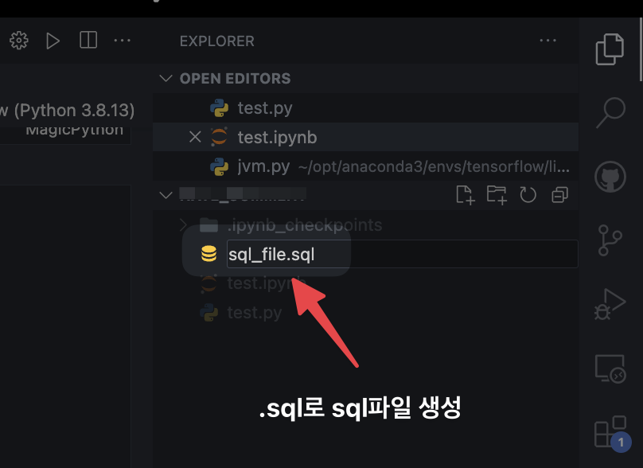

* toc
{:toc}

- SQL 쿼리를 실행할 때, Command Line에서 sql문을 하나씩 써가며 단편적으로 실행할 수도 있지만, 실행할 쿼리문이 여러 가지이거나 쿼리문이 아주 길 때, SQL파일을 활용하면, 더 편리하고 손쉽게 쿼리문들을 실행할 수 있습니다.

## SQL파일 생성

- SQL파일은 다른 파일 생성과 마찬가지로 파일명 뒤에 sql을 붙여주면 생성할 수 있습니다.



- SQL파일 예시

```sql
CREATE TABLE celeb(
  name varchar(10),
  agency varchar(16)
);

INSERT INTO celeb VALUES('유재석', '안테나');
INSERT INTO celeb VALUES('악동뮤지션', 'YG');
INSERT INTO celeb VALUES('싸이', 'P-nation');
...
```

## SQL 파일 실행

- SQL파일은 command line에서 MySQL서버에 접속 후, `source`명령어나 `\.`를 사용하여 실행합니다.
```
mysql> source /path/to/sqlfile.sql
mysql> \. /path/to/sqlfile.sql
```

- 실행하고자 하는 SQL파일이 존재하는 directory에서 MySQL서버를 접속하면, 폴더 path를 생략하고도 SQL파일을 실행할 수 있습니다.
```
mysql> source /path/to/sqlfile.sql
```

- MySQL서버에 접속하는 동시에 맨 끝에 `데이터베이스 < SQL파일 경로`를 붙여주면, 접속과 동시에 SQL파일을 MySQL내에서 실행할 수도 있습니다.
```
> mysql -u root -p db_name < /path/to/sqlfile.dql
```

## SQL파일 활용

### 데이터 백업

- SQL파일을 활용하여 데이터베이스 내 데이터들을 SQL파일 형식으로 백업해둘 수 있습니다.
- 데이터 백업때 사용하는 명령어는 `mysqldump`입니다 (MySQL서버에 접속하지 않고 command line에서 바로 사용합니다)

```
> mysqldump -u username -p dbname > backup.sql
> mysqldump -u username -p --all-databases > backup.sql
```